# Complementi di basi di dati

## Dati semi-strutturati e non strutturati

L'avvento di Internet e delle piattaforme di media sharing ha introdotto dati
differenti dai classici dati relazionali.

Tipi di dati:

- strutturati $\to$ es. tabelle SQL
- semi-strutturati $\to$ es. pagina HTML $\to$ presenta una struttura parziale
- non strutturati $\to$ es. testi, audio, immagini $\to$ la gestione e l'accesso
  di questi dati viene chiamata **information retrieval**.

##### Digital Library vs Information Retrieval

Sono concetti molto simili, la differenza risiede nel fatto che con l'information
retrieval, la ricerca non riguarda solo il documento, ma anche il suo contenuto.

### Dati relazionali vs Dati semi-strutturati

| Relazionali                                  | Semi-strutturati                           |
| -------------------------------------------- | ------------------------------------------ |
| Distinzione chiara tra **schema** e **dato** | **schema parziale** con proprietà dei dati |
| Si fonda sul concetto di insieme             | Si fonda sul concetto di lista             |
| Non ordinati                                 | Ordinati $\to$ rappresentazione come lista |
| Non annidati                                 | Annidati                                   |

### XML $\to$ linguaggio per dati non strutturati

Due usi principali:

- Dati strutturati $\to$ utile per traduzione da SQL prima di scambiare questi dati
- Dati semi-strutturati $\to$ utile per questa tipologia $\to$ struttura flessibile, e
  facilità nella rappresentazione (e indicizzazione) di contenuti ricorsivi.

### Limitazione del modello relazionale

- Difficoltà nell'indicizzazione di contenuti con strutture ricorsive ad albero
- Scomodità nella gestione di dati semi-strutturati il cui schema è incerto o
  varia con frequenza
- Questo modello consente di memorizzare solo dati (non informazioni).

### Proprietà di dati semi-strutturati

- schema costruito a **posteriori** $\to$ dal dato
- facilità di **evoluzione** dello schema $\to$ flessibilità nel definire dati e
  schema
- schemi di grandi dimensioni
- schema scoperto **insieme** ai dati
- schema non impone vincoli
- l'interrogazione può riguardare anche lo schema, non solo dati (come SQL)
- con XML abbiamo **ordinamento** e **annidamento mutuo** dei dati.

## Introduzione a XML

- XML (eXtensible Markup Language) $\to$ proviene da SGML (Standard Generalized Markup Language)
- XML e SGML consentono di definire linguaggi di markup domain-specific.
- es. HTML deriva da SGML
- XML $\to$ più semplice e pensato di essere utilizzato come per specificare linguaggi di markup
  per internet, inizialmente nasce come formato per lo scambio di dati.

```xml
<?xml version="1.0" encoding="UTF-8"?>
<Catalogo>
    <Libro id="1">
        <Titolo>Introduzione a XML</Titolo>
        <Autore>Mario Rossi</Autore>
        <Anno>2021</Anno>
        <Prezzo>19.90</Prezzo>
    </Libro>
    <Libro id="2">
        <Titolo>Programmare in Python</Titolo>
        <Autore>Luca Bianchi</Autore>
        <Anno>2023</Anno>
        <Prezzo>29.50</Prezzo>
    </Libro>
    <Libro id="3">
        <Titolo>Sistemi Distribuiti</Titolo>
        <Autore>Giulia Verdi</Autore>
        <Anno>2022</Anno>
        <Prezzo>34.00</Prezzo>
    </Libro>
</Catalogo>
```

Le colorazioni differenti del testo distinguano il **markup** dai **dati**.
`<?xml version="1.0" encoding="UTF-8"?>` forma il **prologo** $\to$ info utili per una corretta
comprensione del documento:

- dichiarazione che attesta che il documento è XML
- **grammatica** che consente una validazione del contenuto del documento.
- **Processing Instructions** $\to$ info utili a programmi che andranno a leggere il documento.

Si tratta di elementi **opzionali**.
Tutto il resto prende il nome di **body**.

### Elementi

Possono avere 2 forme:

```xml
<name attribute_list>
</name>

<name attribute_list/>
```

### Scrittura corretta di elementi e attributi

- nomi di elementi e attributi sono **case-sensitive**
- il nesting degli elementi dev'essere corretto: ad esempio `<b><i>fghd</b></i>` è errato.
- valori attributi racchiusi da `""` o `''`
- un elemento può avere al più 1 elemento con lo stesso nome.

### Document Type Declaration

Può comparire all'inizio di documento XML. Contiene una grammatica detta **Document Type
Definition** $\to$ formata da **dichiarazioni markup** che definiscono cosa può o non può
essere scritto nel documento:

1. **struttura elementi**
2. **cardinalità elementi**
3. **attributi**
4. **tipi di contenuti**

### Documenti validi

$$
\text{Documenti Validi} \subset \text{Documenti Corretti}
$$

> **Documento Valido:** documento provvisto di DTD e che la rispetti.

Una DTD introduce quindi dei vincoli su un documento XML, ma è possibile introdurre
vincoli ancora più stringenti:

- import di chiavi
- vincoli di unicità
- tipi degli elementi

Questi vincoli vengono espressi in XML.

### Uso corretto di XML

XML consente un grado di libertà elevato nella definizione di tag e attributi e di dove posizionare
i dati, tuttavia quando viene poi utilizzato occorre farne un uso corretto:

- Dati come contenuti e non come attributi
- Metadati non negli attributi o nei nomi degli elementi.
- Uso corretto gerarchie

## Dati relazionali e XML

### SQL/XML

Standard che implementa un ponte tra XML e SQL $\to$ utile per scambio di dati in formato
relazionale. Il ponte può essere percorso in 2 direzioni:

- SQL $\to$ XML: estrazione dati da DB relazionali
- XML $\to$ SQL: storage di dati XML in una o più tabelle relazionali.

Dato che XML è pensato sia per dati strutturati che semi-strutturati, la prima task è facile,
mentre a seconda è difficile.

#### Estrazione XML da una tabella

Può essere implementata in due modi.

##### 1. XML + XQuery

L'approccio prevede la traduzione in XML (**mapping**) e la seguente estrazione tramite **XQuery**

- Si parte da una tabella relazionale
- nome documento &larr; nome tabella
- elemento `<row>` &larr; riga tabella
- elemento avente nome dell'attributo &larr; valore tabella

Lo standard che definisce il mapping è **SQL/XML**.

Esempio di estrazione XQuery:

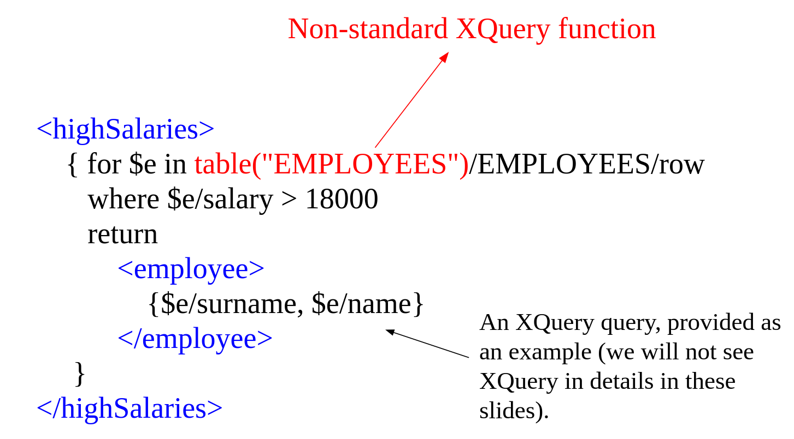

##### 2. SQL/XML

L'approccio prevede l'estrazione dei dati tramite query SQL, e poi la seguente traduzione in
XML secondo SQL/XML.

#### Salvare XML in DB relazionali

Abbiamo due modi principali:

- Object-Relational columns per memorizzare XML in un unico campo
- **Shredding** dei documenti $\to$ elementi diversi in campi diversi, qui serve
  eseguire un lavoro di parsing del file XML per suddividerlo nei campi della tabella relazionale.

## Il linguaggio SQL/XML

Si tratta di un'estensione di SQL per XML, facente parte della specifica SQL.

Fornisce strumenti per permettere salvataggio di dati XML in DB relazionali $\to$ costruttori,
routine, funzioni di manipolazione per file XML.

### Estrazione di XML tramite SQL/XML

Operazioni definite ad-hoc:

- **XMLELEMENT** $\to$ creazione di un elemento XML, i suoi input sono:
  - nome elemento
  - lista di attributi (opzionale)
  - contenuto dell'elemento

  Consente di concatenare anche più campi SQL nello stesso risultato con l'operatore `||`.

  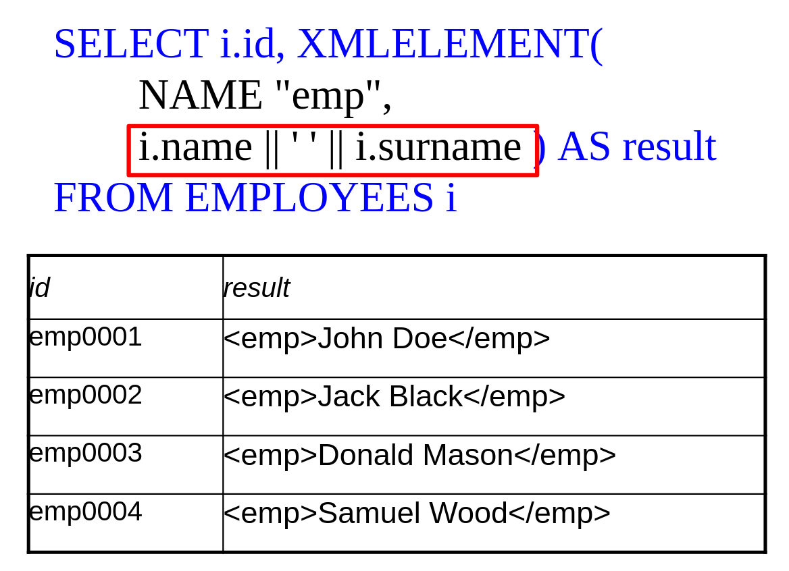

- **XMLATTRIBUTES** $\to$ dichiarazione di una lista di attributi, ogni parametro passato
  viene inserito in un attributo. Attributo non dichiarato $\to$ nome della colonna relazionale
  di provenienza del dato.

  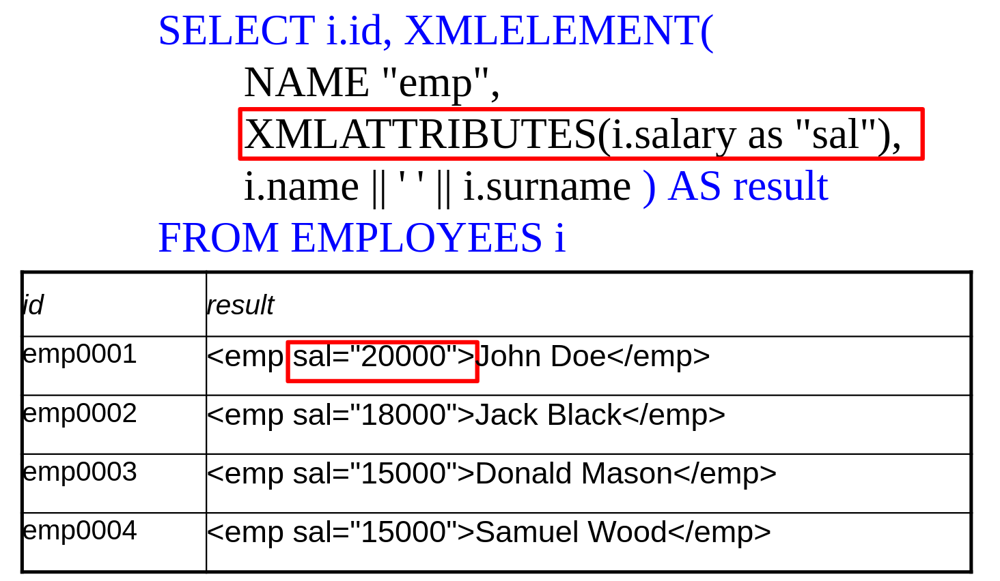

- **XMLFOREST** $\to$ shortcut per creare una lista di elementi semplici, parametri di input
  come `XMLATTRIBUTES`.

  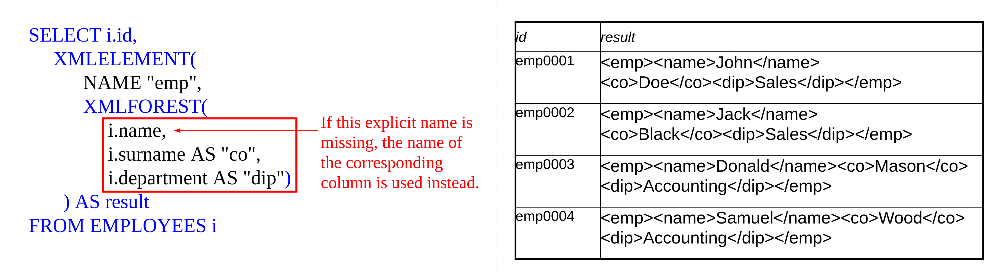

- **XMLCONCAT** $\to$ concatena gli argomenti producendo una foresta di elementi, può
  concatenare anche elementi costruiti con `XMLELEMENT`.

  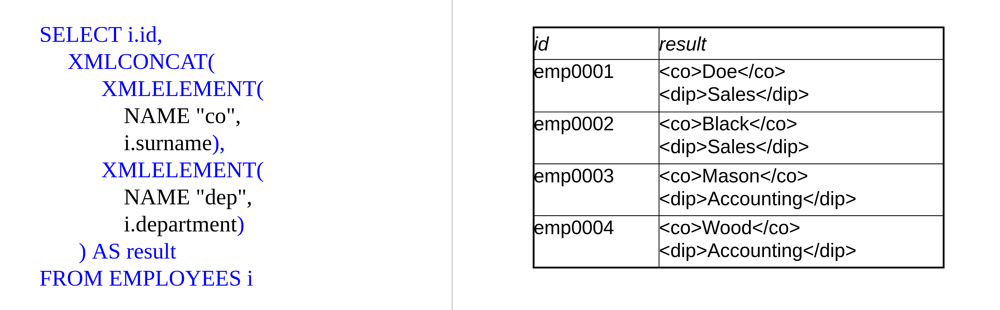

- **XMLAGG** $\to$ consente di utilizzare `GROUP BY` sulle tuple ottenute

  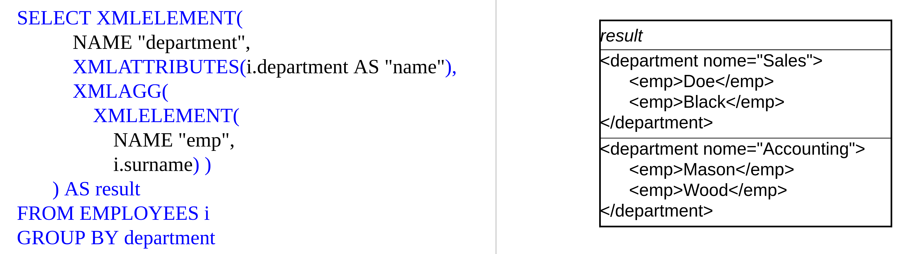

- **XMLGEN** $\to$ realizzazione di codice XML inserendo i dai direttamente tra `{ }`.
  Con questa istruzione, i nomi delle colonne possono essere usati come nome degli elementi XML,
  cosa che non era fattibile con `XMLELEMENT`.

  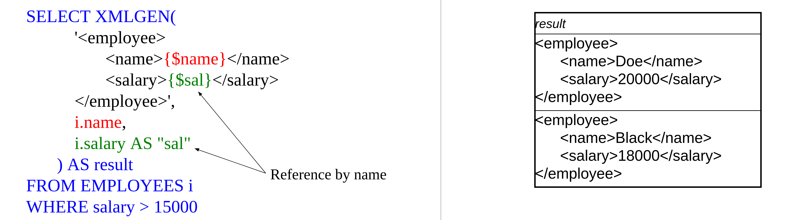

## XQuery

XQuery opera su sequenze, non sulle relazioni, che possono contenere:

- valori atomici (costanti)
- nodi

Un'espressione XQuery riceve 0 (costruttori) o più sequenze e produce una sequenza.

### Sequenze

#### Proprietà delle sequenze

- ordinate
- **non** innestate
- non c'è differenza tra un elemento e una sequenza che lo contiene: (1) = 1

#### Operatori di manipolazione

- virgola $\to$ (1,2,3)
- `to` $\to$ (1 to 3)
- `union`, `intersect`, `except`:
  - (A) union (A, B) $\to$ (A, B)
  - (A, B) union (B, C) $\to$ (B)
  - (A, B) except (B) $\to$ (A)

### Nodi

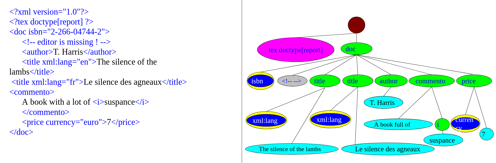
Possono essere contenuti in una sequenza. Tipi di nodi:

- **document**
- **element**
- **attribute**
- **namespace**
- **text**
- **comment**
- **processing instruction**

Namespaces, comments e processing instructions non andrebbero usati per salvare dati.
Il **valore testuale** dei nodi document e element è dato dalla concatenazione dei
valori testuali di tutti i loro discendenti testuali, nell’ordine in cui essi
appaiono nel documento.

I nodi attribute non sono ordinati, in caso di estrazione tramite Query, il loro ordine
potrebbe essere diverso da quello del documento XML. Dopo l'estrazione sono
inseriti in una sequenza di cui tengono l'ordinamento.

Due nodi **testuali** non possono essere adiacenti.

Se al documento è associato uno schema, esso può definire i tipi dei nodi.

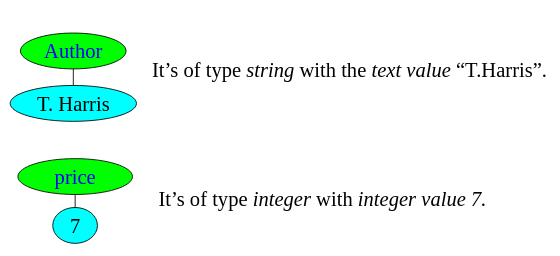

## Path Expressions

- estrazione di valori da nodi XML, consentendo di controllarne le proprietà
- elabora esclusivamente **sequenze**
- una path expression è una serie di passi separati da `/` $\to$ ogni step viene
  valutato in un **context** (sequenza di nodi con info aggiuntive) e la valutazione
  produce una sequenza.
- ogni step viene eseguito utilizzando come contesto la sequenza prodotta dal
  passo precedente

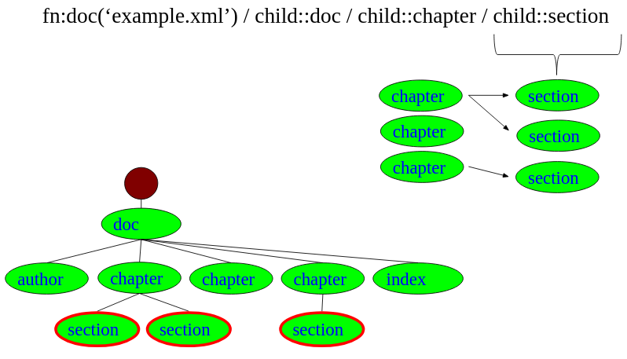

### Struttura di uno step

3 componenti principali:

- asse $\to$ selezione nodi in base alla loro posizione rispetto al nodo di contesto
- test $\to$ filtraggio nodi in base a nome e tipo
- predicati ulteriori $\to$ ulteriore filtraggio su vari criteri

#### Assi

Una lista di possibili assi:

- **self::**
- **child::**
- **parent::**
- **ancestor::**
- **descendant::**
- **following-sibling::**
- **preceding-sibling::**
- **attribute::**

Possono essere combinati fra loro.

#### Test

Filtraggio elementi selezionati dall'asse verificando il nome o il tipo o entrambi:

- Filtraggio per nome:
  - `child::section` $\to$ figli con tag `<section>`
  - `child:: \*` $\to$ tutti i figli
  - `attribute::xml:lang` $\to$ ritorna attributo con xml:lang

- Filtraggio per tipo:
  - `descendant::node()` $\to$ tutti i nodi discendenti
  - `descendant::text()` $\to$ tutti i nodi discendenti di tipo text
  - `descendant::element()` $\to$ tutti i nodi elementi discendenti

- Filtraggio su entrambi:
  - `descendant::element(person, xs:decimal)` $\to$ elementi persona di tipo decimale

#### Predicati

Possono essere presenti anche in numero maggiore di 1, tramite congiunzione delle
rispettive condizioni, sintassi: `[predicato1][predicato2]`

#### Valutazione dei predicati

Vari tipi di predicati, alcuni esempi:

- `child::chapter[2]` $\to$ secondo figlio con tag `<chapter>`
- `child::chapter[child::title]` $\to$ figli con tag `<chapter>` che hanno almeno
  un figlio con tag `<title>`.
- `child::chapter[attribute::xml:lang="it"]` $\to$ figli con tag `<chapter>` che
  hanno un attributo `xml:lang` con valore "it".

### Path Expressions complete

Può iniziare anche con:

- il carattere `/` $\to$ sequenza di input che contiene la radice dell'albero
- i caratteri `//` $\to$ sequenza di input che contiene tutti i nodi del documento

Esempi:

- `/child::book / child::chapter[5] / child::section[2]` $\to$ seconda sezione del quinto capitolo
- `//self::chapter[child::title]` $\to$ tutti i capitoli con almeno un figlio `<title>`.

### Sintassi corta

- omissione dell'asse `child::`
- carattere `@` al posto di `attribute::`
- `//` al posto di `descendant-or-self::node()`
- `.` al posto di `self::node`
- `..` al posto di `parent::node`

## FLWOR Expressions

- **for**
- **let**
- **where**
- **order by**
- **return**

### Clausola For

Iterazione sugli elementi di una path expression.

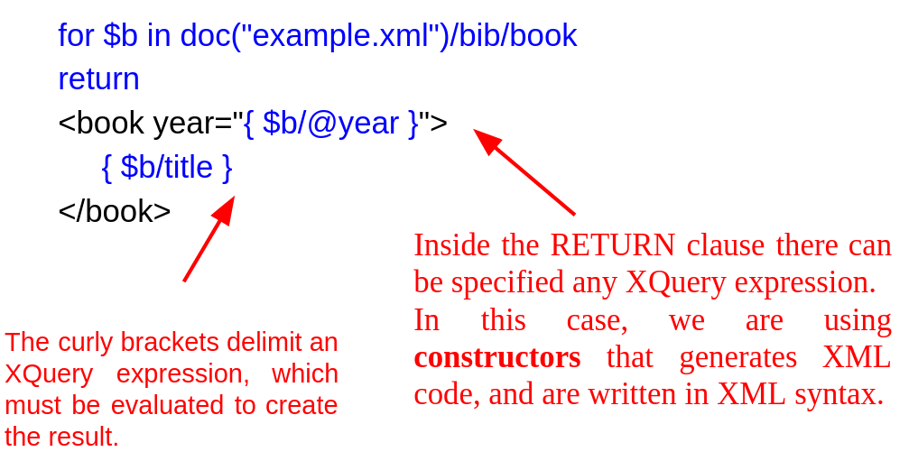

- for annidato $\to$ `for $i in (10,20), $j in (1,2) return ($i + $j)` $\to$ (11,12,21,22)
- somma elementi sequenza $\to$ `sum(for $i in order return $i/@price * $i/@qty)`

### Clausola Where

Per iterazioni con filtro.

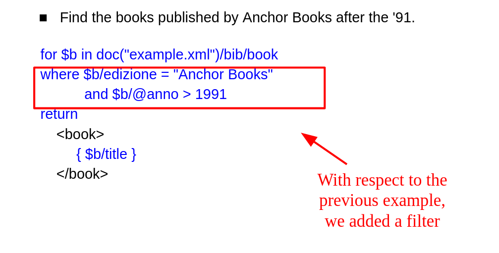

### Clausola Let

Per espressioni con funzioni aggregate.

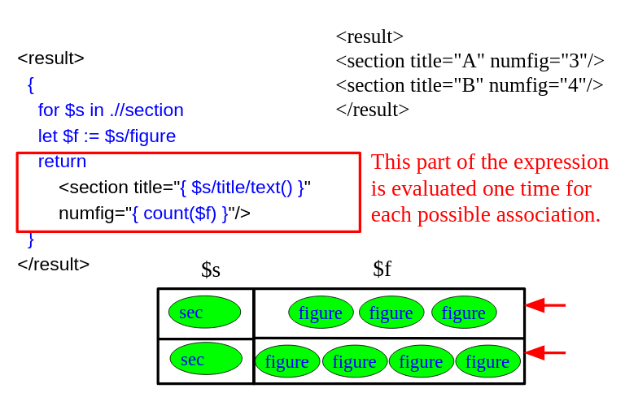

### JOIN in XQuery

Produzione di documenti XML a partire da due documenti indipendenti che si caratterizzano per
la presenza di un elementi con identificatore comune ai due documenti.

Esempio:

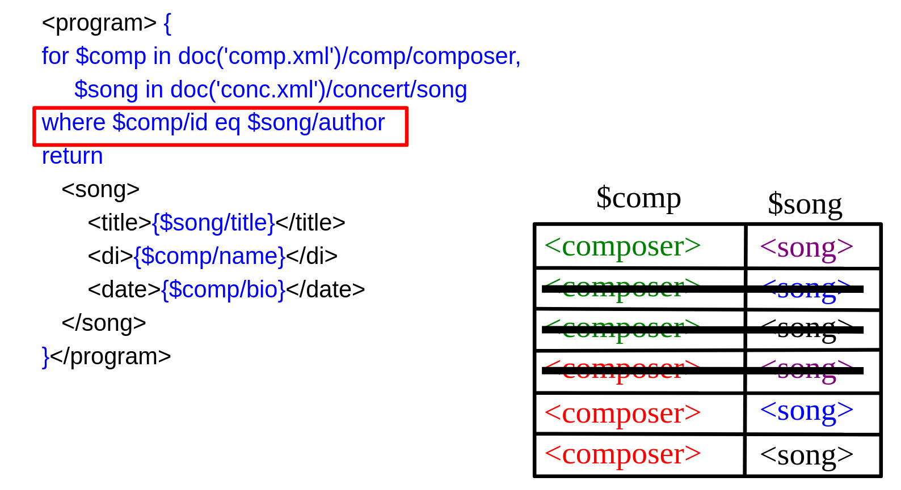

Join $\iff$ `for` annidato + `where`

### Order by

Ordinamento del risultato di una espressione FLWOR. Per invertire l'ordinamento è possibile
aggiungere `descending` a fine statement.

## Altre Espressioni

### Espressioni condizionali

Semplice esempio:

```xquery
let $person := <person><age>20</age></person>
let $age := $person/age
return
  if ($age >= 18) then
    <result>Adult</result>
  else
    <result>Minor</result>

```

Il controllo dell'esistenza di un attributo avviene come nei linguaggi di programmazione classici:
`if(attribute) ...`.

### Operatori di confronto

I classici operatori di confronto funzionano solo su sequenze, non su singoli elementi $\to$
usati con attenzione:

- gli operatori `=` e `!=` non sono transitivi
- (1,2) = (2,3) è un'espressione che ritorna vero

#### Soluzione

Con XPath 2.0 sono stati introdotti operatori per confronto di singoli elementi:

- `eq`, `ne`, `lt`, `le`, `gt`, `ge`
- esempio: `&book/author eq "Oliver"` sarà valutata solo se è stato selezionato sono un nodo
  autore, altrimenti avverrà un errore.

### Operatori logici e aritmetici

- `or`, `and`, `fn:not()`.
- `+`, `-`, `*`, `div` (divisione intera), `mod`.

### Espressioni con quantificatori

- operatori `every`, `some` e `satisfies`. Esempio:

```xquery
some $emp in //employee
satisfies ($emp/salary > 1300)
```

L'espressione soprastante è vera solo se almento un impiegato guadagna più di 1300.
`every` è analogo a `some`, con la differenza che quest'ultimo è un operatore di quantificazione
**esistenziale**, mentre il primo è **universale**.

### Funzioni standard

#### Funzioni di input

Servono per ottenere il codice XML da interrogare:

- accesso al singolo documento con `doc`
- accesso a una sequenza di documenti con `collection`

#### Funzioni su sequenze di nodi

- `fn:position()` $\to$ posizione nodo corrente
- `fn:last()` $\to$ numero di nodi
- `fn:count($elements)` $\to$ cardinalità della sequenza di nodi in input alla funzione

#### Funzioni aggregate

- `count`
- `avg`
- `max`
- `min`
- `sum`

## XQuery in DB2, Oracle, and SQL Server

I seguenti documenti XML saranno utilizzati nei vari esempi.

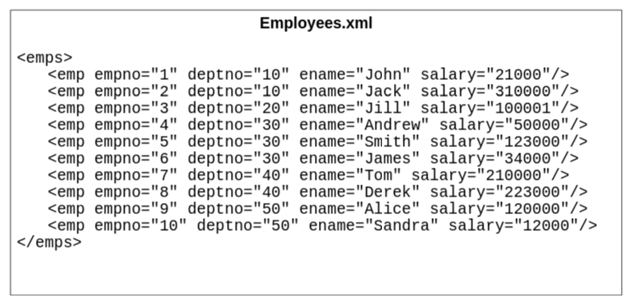

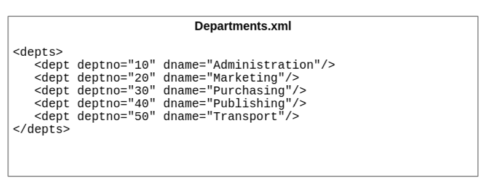

Confronto di del supporto dello standard XQuery di alcuni dei DBMS più famosi:

- DB2 Express-C (v10.1)
- Oracle XML DB (v11.2)
- MS SQL Server 2012

## XQuery su DB2

- consente inserimento di colonne **XML** in database relazionali tramite comando `INSERT` + funzione
  `XMLPARSE` che prende stringa in input e se valida, la converte in XML.
- query XQuery inserite nella clausola `SELECT` delle query SQL tramite la funzione `XMLQUERY`, che
  ritorna frammenti XML.
- `XMLEXISTS` utilizzabile con clausole `WHERE`
- `XMLTABLE` utilizzabile con clausole `FROM`

### Path expressions

Supporto completo allo standard XPath.

### Creazione tabelle

Si definisce un'unica colonna con tipo di dato `XML`.

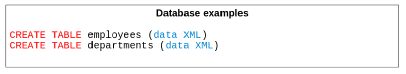

### Inserimento dati

- `XMLPARSE` con `INSERT`, passando il contenuto XML come stringa
- si può scegliere se lasciare o meno gli spazi bianchi

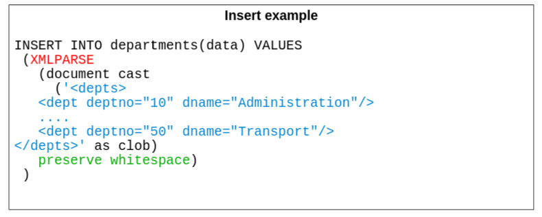

### Selezione dati

- `XMLQUERY` per inserire la query in una clausola `SELECT`
- clausola `passing` $\to$ realizzazione di alias per riferirsi a codice XML precedentemente
  inserito nella tabella

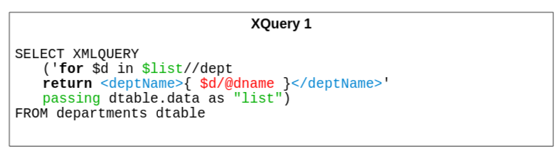

- utilizzo di `where` e `order by` per realizzare query più complesse.

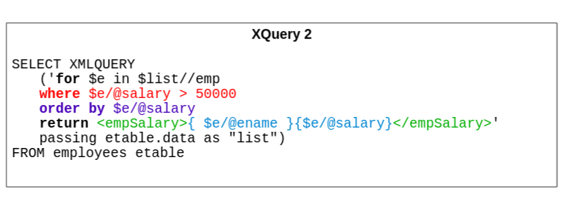

- `let` + operatori ai aggregazione

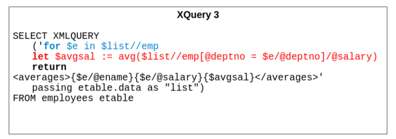

- operatori di decisione $\to$ `if-then-else`

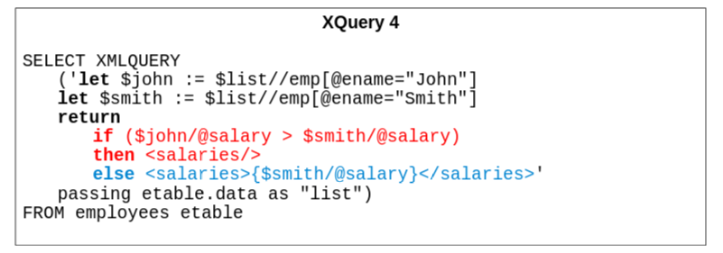

- esempio con `let` fuori dal ciclo $\to$ una sola esecuzione

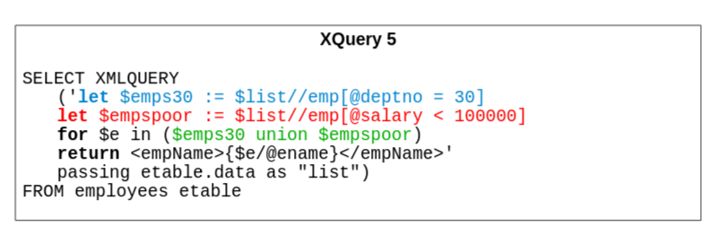

- posso eseguire query con quantificatori: `some`, `every` + `satisfies`.

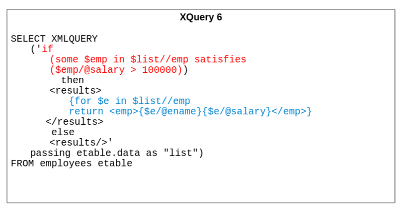

- anche i `JOIN` sono supportati tramite l'uso di `where`

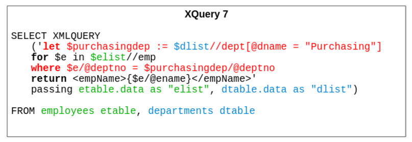

- altri esempi più complessi che fanno dei vari costrutti visti finora.

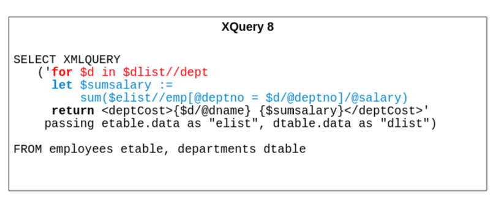

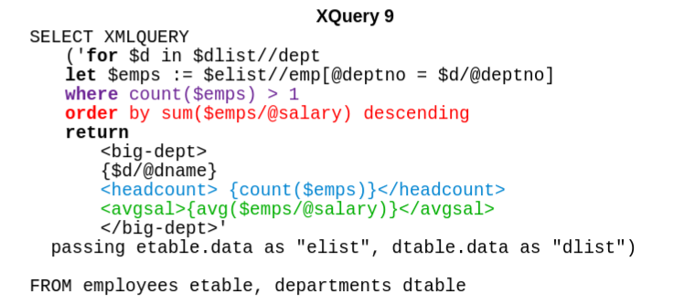

## XQuery su Oracle DB

Supporto completo a XQuery, molto simile e DB2.

### Feature di XQuery non supportate

- **non** si può specificare l'encoding di un'espressione XQuery
- **xml:id**
- **xs:duration** $\to$ **xs.yearMonthDuration** o **xs:DayTimeDuration** come alternative
- **schema validation**
- **model feature**

### Feature di XPath 2.0 non supportate

- funzioni per regex non utilizzabili $\to$ solo quelle **built-in** del DBMS
- **fn:id**
- **fn:idref**
- **fn:collection** senza argomenti

### Creazione tabelle

C'è la possibilità di creare tabelle direttamente di tipo XML, non solo la colonna.

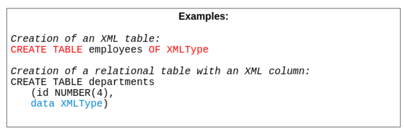

Ciò avviene con il tipo `XMLType`.

#### Implementazione di XMLType

2 modi:

- **LOB** $\to$ Large OBject, sorta di stringa.
- **Storage strutturato** $\to$ DBMS costruisce automaticamente tabelle e viste che seguono lo
  schema del documento XML, per salvare correttamente i nodi di quest'ultimo.

### Inserimento dati

- Utilizzo funzione `XMLType` + `INSERT`, passando il frammento XML da inserire

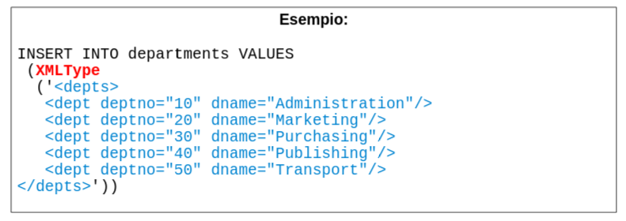

### Selezione dati

Sintassi quasi identica a DB2 $\to$ `passing` leggermente diversa e c'è in più la clausola
`returning content` alla fine.

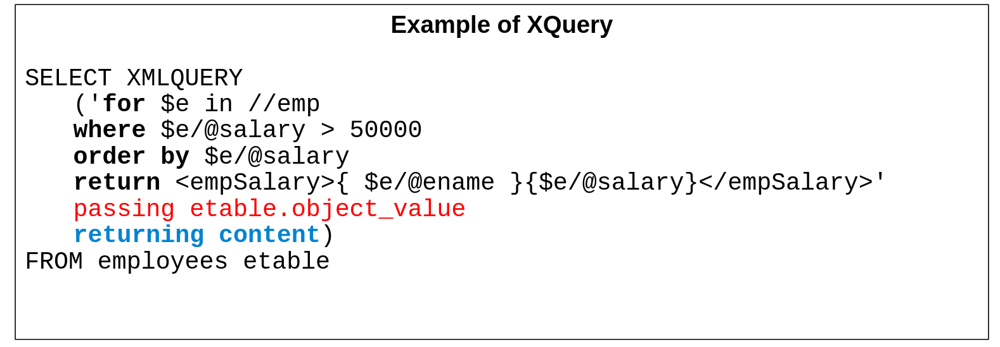

### Query direttamente su file XML

Possibile tramite la funzione `doc()` che riceve in input il path del file
XML da interrogare direttamente, senza passare per una tabella relazionale.

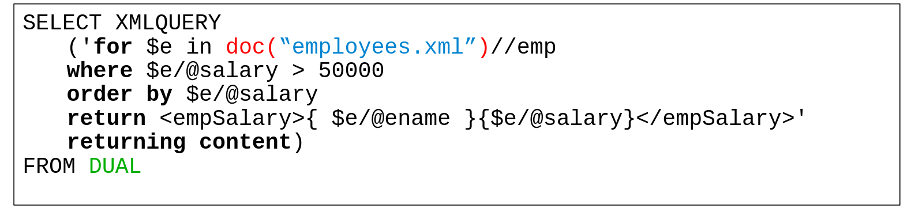

La keyword `DUAL` indica una tabella vuota, non ha alcuna utilità pratica, ma serve perché
la clausola `FROM` è obbligatoria in tutte le query SQL.

## XQuery su SQL Server 2012

### Feature non supportate: Sequenze

- devono essere omogenee $\to$ solo **nodi** o solo **valori atomici**
- operatore `to` non supportato
- sequenze non combinabili tramite `union`, `intersect`, `except`.

### Feature non supportate: Path Expressions

- assi utilizzabili: **child, descendant, parent, attribute, self, descendant-or-self**
- tipi di nodi utilizzabili: **comment, node, processing-instruction, text**

### FLWOR

Supporto completo, `let` ha un comportamento leggermente diverso $\to$ eseguita ogni
volta che c'è una reference alla variabile.

### Altri operatori

Tutti gli altri operatori già visti sono supportati, ad eccezione di:

- `not`
- `idiv`

### Creazione

Uguale a DB2.

### Inserimento

Più semplice $\to$ inserimento diretto stringa XML.

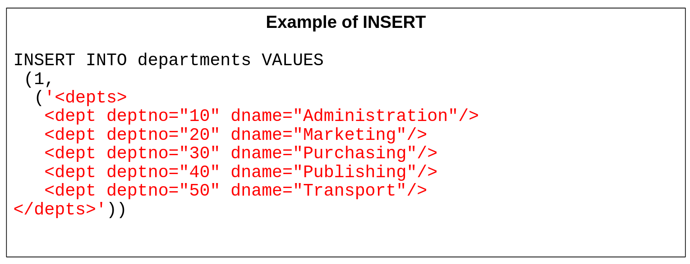

### Selezione

Anche questa leggermente semplificata $\to$ non serve `passing`.

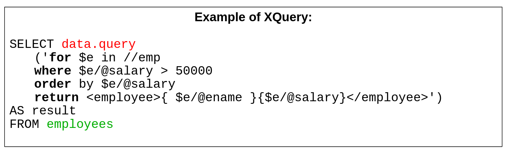

## XQuery su Oracle Berkley DB XML

Oracle Berkley non è un vero DBMs $\to$ set di librerie per gestire DB con XML semplicemente.
$\to$ privo di supporto per DB relazionali.

### Operazioni

- creazione **container** $\to$ oggetto fondamentale, paragonabile alle tabelle relazionali
- inserimento frammenti XML nel container
- recupero frammenti tramite XQuery
- uso di XML Schema per inserire **constraint** sui docs.
- creazione di **indici**

#### Creazione container

2 tipi di storage:

- **per documento** $\to$ storage del documento così com'è
- **per nodi** $\to$ documenti decomposti nei nodi che li contengono $\to$ garantisce
  migliori performance e permette di modificare il documento in futuro

```bash
dbxml> createContainer esempio.dbxml
```

#### Inserimento documenti

```bash
dbxml> putDocument <namePrefix> <string> [f|s|q]
```

Flag terzo parametro:

- `f` $\to$ input file invece di stringa $\to$ secondo parametro è un path
- `s` $\to$ secondo parametro è la stringa associata al frammento XML

#### Query

```bash
# Retrieve the whole content of the collection
dbxml> query 'collection("esempio.dbxml")'

# Retrieve the title of all the books that have John as author
dbxml> query 'collection("esempio.dbxml")/book[author="John"]/title'

# Retrieve the title of all the books with a price greater than 100
dbxml> query 'for $book in collection("esempio.dbxml")
where $book/price > 100
return $book/title'
```

#### Constraints

- Si può realizzare un binding tra schema XML e container $\to$ solo documenti che rispettano
  lo schema vengono inseriti

- Altri constraints possono essere aggiunti

## NoSQL

Non ha una definizione rigorosa $\to$ qualsiasi DB non relazionale.

### Proprietà DB relazionali

- **basi solide** $\to$ modello relazionale
- **altamente strutturati** $\to$ righe, colonne, tipi
- **SQL** $\to$ standardizzato
- **ACID**
- **Join** $\to$ nuove viste dalle relazioni

### L'arrivo dei big data

5 _v_ dei big data:

- Volume
- Velocità
- Varietà
- Variabilità
- Veridicità

Richiedono:

1. **Flessibilità e schema** $\to$ Variabilità e Veridicità
2. **Dati distribuiti** $\to$ Volume
3. **Alta disponibilità** $\to$ Velocità

### Debolezze DB relazionali

- **Join** $\to$ non scalabili
- **Transazioni** $\to$ R/W lente per via dei meccanismi di lock.
- **Schema fissi**
- **Integrazione documenti** $\to$ difficile creare report su dati strutturati e non strutturati

### BASE

I DB non relazionali sono **BASE**:

- **Basic Availability** $\to$ tolleranza fallimento parziale
- **Soft State** $\to$ stato del DB può cambiare
- **Eventual Consistency** $\to$ inconsistenza a breve termine, ma consistenza a lungo termine

#### Basically Available

Il sistema **non garantisce piena disponibilità** del dato (CAP theorem). Ogni richiesta riceverà sempre
una risposta, tuttavia:

- la risposta potrebbe essere una **comunicazione di fallimento**
- il dato potrebbe essere in uno **stato inconsistente o changing**

#### Soft state

Il sistema consente incoerenze temporanee prima di raggiungere eventualmente la coerenza automaticamente
nel tempo.

#### Eventual consistency

- il sistema diventerà **eventualmente** consistente quando smette di ricevere input
- il cambiamento arriverà a tutti i nodi del DB distribuito (prima o poi)
- nel frattempo il sistema continua a ricevere input nel frattempo
- non avviene un controllo di consistenza per ogni transazione prima di passare alla successiva

#### ACID vs BASE

- **ACID**:
  - Forte coerenza.
  - Minore disponibilità.
  - Concorrenza pessimistica.
  - Complesso.

- **BASE**:
  - La disponibilità è la cosa più importante $\to$ disposto a sacrificare altre proprietà per
    ottenerla (consistenza).
  - Consistenza più debole (eventuale).
  - Miglior sforzo.
  - Semplice e veloce.
  - Ottimistico.

- Perché non possiamo avere entrambi? Esiste un compromesso tra coerenza, disponibilità e tolleranza
  alle partizioni (cioè il Teorema CAP).

### CAP tradeoff

- **Consistency** $\to$ indica se il sistema distribuito opera come una singola unità $\to$
  lo stesso dato ha effettivamente la stessa forma su ogni nodo.

- **Availability** $\to$ il sistema è sempre up e funzionante?

- **Partition Tolerance** $\to$ indica se il sistema è in grado di operare ache in caso di circostanze
  di perdite di dati o failure a livello di sistema $\to$ un fallimento su un nodo **non dovrebbe**
  causare il collasso dell'intero sistema

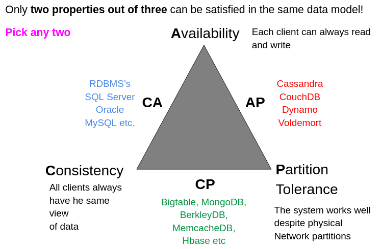

### NoSQL è schema-less

- DB relazionali:
  - impossibile aggiungere record che non rispettano lo schema
  - elementi non usati $\to$ devo usare **NULL**
  - tipato
  - impossibile più elementi in un campo

- NoSQL:
  - no schema
  - no celle inutilizzate
  - no tipi di dati (impliciti)
  - più elementi uniti in un'unica struttura detta **documento**

#### Aggregation

- aggregato è un cluster di oggetti che possono essere trattati come un'unità unica
- gli aggregati sono l'elemento di base del trasferimento $\to$ si richiede di caricare o salvare
  interi aggregati

- le transazioni non dovrebbero oltrepassare i limiti dell'aggregato (???)
- questo approccio riduce i join

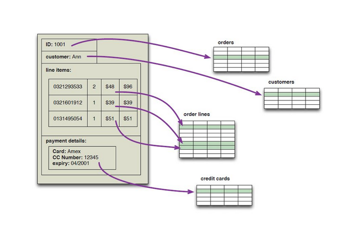

### Polyglot persistance

Utilizzo di più DB engine $\to$ gestione corretta di dati differenti e requisiti di accesso dei
dati.

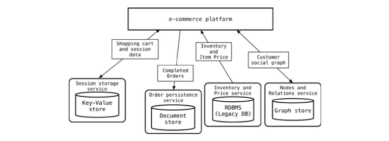

### Key-Value Store

Il dato è contenuto nel valore e può avere varie forme, non tipate esplicitamente.

- Basato su hash table
- Accesso ai dati tramite le **key**
- non c'è un formato definito per i dati
- data model $\to$ (key, value) pairs
- Operazioni:
  - Insert(key, value)
  - Fetch(key)
  - Update(key, updatedValue)
  - Delete(key)

Effettivamente il dato è un "blob" $\to$ è responsabilità dell'app client interpretare il dato

### Document Data Model

- **Document**: XML, Json, text, blob
- simile a key-value, la differenza è che il valore è un documento

| **RDBMS** |        | **MongoDB**                         |
| --------- | ------ | ----------------------------------- |
| Database  | $\iff$ | Database                            |
| Table     | $\iff$ | Collection                          |
| Row       | $\iff$ | Document                            |
| Index     | $\iff$ | Index                               |
| JOIN      | $\iff$ | Documento incorporato o Riferimento |

### Columnar data model

Tabelle salvate come colonne di dati invece di righe di dati.

- Si tratta di un'estensione alla struttura tradizionale delle tabelle.

- Ottimizzato operazioni a livello di colonna (sum,count, mean avg, ... )

- Più valori (colonne) per una chiave

### Graph data model

- dati hanno struttura basata su grafo
- sfrutta la teoria dei grafi
- vertical scaling, no clustering
- facilità di utilizzo di algoritmi per grafi
- transazioni
- ACID

## Introduzione Information Retrieval

> **Definizione**: **ricerca di materiale** di natura **non strutturata** che soddisfi
> **l'information need** da un collezione di contenuti informativi **molto larga**

### Definizioni di base

- **Documento**: file non strutturato
- **Collezione**: insieme di documenti
- **Query**: insieme di keyword per esprimere un bisogno informativo
- **Goal**: ottenere informazioni che siano rilevanti per il bisogno
  informativo dell'utente e che lo aiutino a completare la sua task

### Modello di ricerca classico

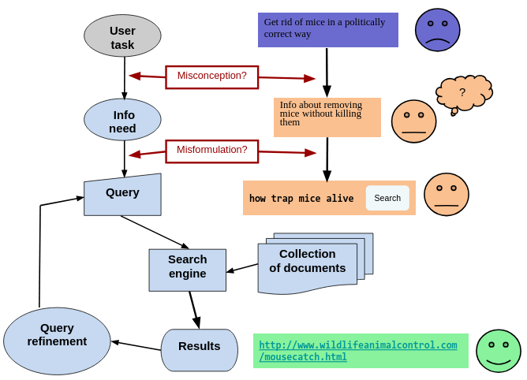

### Proprietà dei documenti

- contenuto testuale abbondante
- principalmente non strutturati
- presenta di qualche informazione strutturata $\to$ es. titolo, autore, data per paper o
  mittente e oggetto per mail.

### Data retrieval vs Information retrieval

| Data retrieval                                             | Information retrieval                                                                     |
| ---------------------------------------------------------- | ----------------------------------------------------------------------------------------- |
| contenuto strutturato con campi tipato                     | non strutturato                                                                           |
| valori consistenti con tipi di dato definiti               | ogni tipo di dato in ogni possibile formato                                               |
| dati salvati in formati predefiniti                        | linguaggio naturale (ambiguità)                                                           |
| risposta indipendente dall'implementazione del sistema     | interpretazioni differenti con sistemi IR diversi                                         |
| la risposta è un set di record che **soddisfano la query** | la risposta è una **ranked list** di risultati ordinati per rilevanza rispetto alla query |

### Comparing text

- occorre dare una nozione di **rilevanza** fra informazioni testuali
- diversi sistemi di IR, solitamente hanno nozioni differenti di IR

## Retrieval Models

- **Classici**
  - Boolean retrieval
  - Vector Space

- **Probabilistici**
  - BM25
  - Language models

- **Combining evidence**
  - Inference networks
  - Learning to Rank

### Boolean Retrieval model

Modello che formula richieste che sono espressioni booleane $\to$ query sono combinazioni
di operatori logici:

- ogni documento visto come un insieme di parole (**bag-of-words**)
- alta precisione $\to$ o match o no, niente mezze vie.

Non si possono usare comandi come `grep` $\to$ lentezza per testi lunghi.
Occorre quindi definire un documento come un **insieme di parole**.

#### Term-document incident matrix

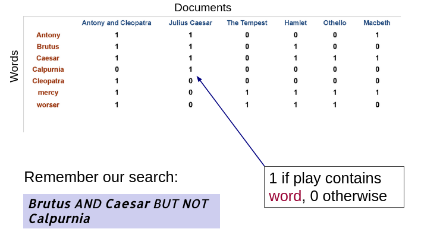

#### Incident vectors

- Per ogni parola abbiamo un vettore di booleani
- risposta = operatori booleani bitwise fra gli elementi dei vettori presenti nella query
  $\to$ elementi 1 nel risultato corrispondono ai documenti che soddisfano la query

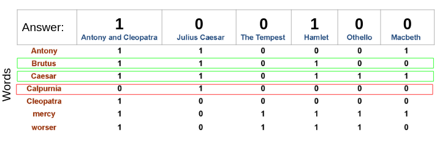

##### Dimensioni della matrice

- $\text{Docs} \times \text{Words in docs} \times \text{Parole per ricerca}$
- il numero di 0 e 1 è altissimo con documenti lunghi e tante parole possibili
  su cui fare la ricerca, spesso il numero di 0 sovrasta quello di 1 $\to$
  matrice **altamente sparsa**

- rappresentazione migliore $\to$ salvare solo le occorrenze degli 1

#### Inverted Index

Per ogni termine $t$ si salva una lista di tutti i documenti che contengono $t$.
Ogni documento è associato a un identificativo.

Usare array a dimensione fissa è impossibile $\to$ la presenza di una parola
in un documento può variare $\to$ aggiunta o rimozione di parole.

##### Posting-list

In RAM implementate con **linked list**, oppure **array a dimensione variabli**
$\to$ tradeoff in base alle operazioni $\to$ scelta in base alle operazioni
effettuate con maggiore frequenza.

Gli elementi delle liste (**postings**) vengono salvati in ordine di ID.
Le parole per la ricerca formano il **dizionario**.

##### Costruzione di inverted index

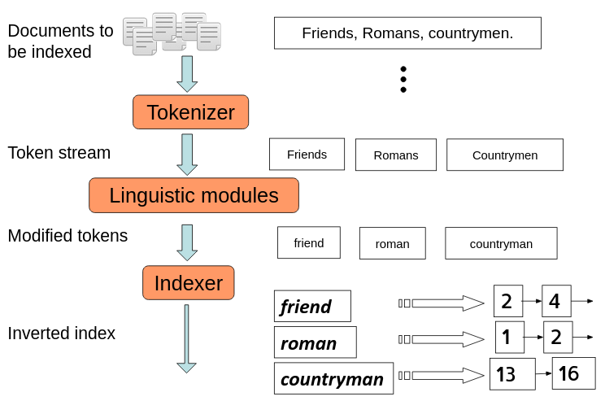

##### Text preprocessing

- **Tokenizzazione**: da sequenze di caratteri $\to$ sequenze di token (parole)
- **Normalizzazione**: token mappati alla stessa **forma _normale_** $\to$ es. _U.S.A_ diventa _USA_
- **Stemming**:
  - rimuove suffissi o prefissi per arrivare alla forma **root**
  - Spesso produce parole non esistenti
  - Es: “running” $\to$ “run”, “studies” $\to$ “studi”
- **Lemmatizzazione**: uso di vocabolari e grammatiche per trovare la forma corretta di un **root**
- **Rimozione stop words**

Stemming e Lemmatizzazione spesso usati insieme.

##### Tokenizzazione

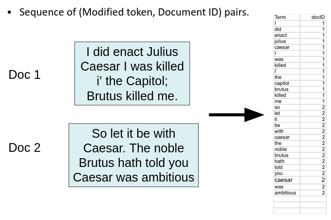

##### Normalizzazione

Il prodotto di questa operazione è un possibile elemento
del **dizionario** del sistema IR, viene detto **termine** .

Alcuni esempio di operazioni eseguite:

- tutto lowercase, magari con regole specifiche per gestire casi a parte
- eliminazione di punti, es: _U.S.A_ $\to$ _USA_, o trattini sia alti che
  bassi

##### Lemmatizzazione

Riduzione di parole derivate (non necessariamente corrette) alla **forma primitiva**.
Esempio: _am, are, is_ $\to$ _be_

Richiede la consultazione di dizionari e/o grammatiche per effettuare le trasformazioni corrette.

##### Stemming

- riduzione termini alla loro **root** prima di indicizzare
- rimozione pesante dei suffissi $\to$ possibili parole insesistenti

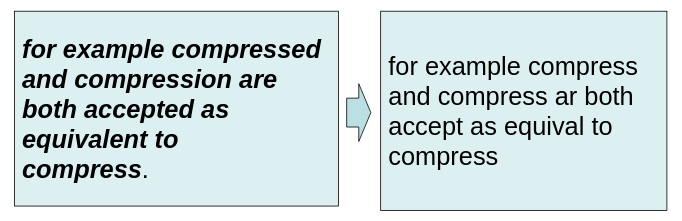

##### Stop Words

Rimozione di parole a basso contenuto semantico, es: _and, the, a, to, ..._

Di recente si tende meno a eseguire questa operazione:

- **sistemi di compressione** consentono a queste parole di occupare pochissimo spazio
- **tecniche di ottimizzazione delle query** $\to$ inclusione di stop words nelle query
  influisce poco sul costo.
- spesso si perdono informazioni escludendo le stop word, alcuni esempi:
  - _King of Denmark_
  - titoli canzoni $\to$ _To be or not to be_
  - quando esprimono una relazione $\to$ _flights to London_

#### Dizionari

Si tratta del lessico dei testi indicizzati (**indexed corpus**). Due tipi di dizionari principali:

- **Language specific**:
  - dizionari per la specifica lingua
- **Domain specific**:
  - dizionari di vocaboli medici $\to$ es. UMLS (Unified Medical Language System)

### Limiti dei modelli booleani

- Inadatti per **utenti non tecnici** $\to$ sono basati su matching esatto, incapaci
  di scrivere query booleane
- Spesso le query si tramutano in **pochissimi** o **tantissimi** risultati $\to$
  la consultazione è difficile nel secondo caso.
- Scrivere query corrette e con pochi risultati può richiedere conoscenze
  molto avanzate per l'utente medio

### Ranked retrieval

Il sistema ritorna un **rank** di documenti ordinato in base a quanto soddisfano la
query $\to$ size del risultato non è più un problema $\to$ l'utente sceglie quanti risultati
vedere $\to$ **top k** .

Un esempio è il **Vector Space Model(VSM)**

### VSM

Documenti rappresenti come **vettori** di **_term weights_**.
Le collezioni sono invece delle matrici.

$d_{ij}$ è il peso dell'$i$-esimo termine nel $j$-esimo documento.

#### Esempio di rappresentazione vettoriale

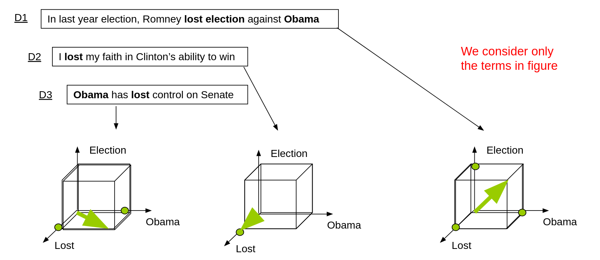

#### Documenti come vettori

- I vettori risultano collocati in uno spazio $\mid V \mid$-dimensionale.
- I termini rappresentano gli **assi** dello spazio.
- I documenti sono punti o vettori
- La dimensionalità può diventare molto elevata
- Si tratta di vettori **sparsi**

#### Query come vettori

- si vuole realizzare il ranking dei documenti in base alla prossimità
  con la query
- proximity = **similarity tra vettori**
- la proximity può essere vista come l'inverso della distanza
- emerge la differenza con il modello boolean $\to$ qui un elemento può essere
  più o meno rilvante, ma non c'è più la distinzione netta rilevante/non-rilevante
  del modello booleano.

Prima di definire la **similarity** occorre definire la **term frequency**

#### Term Frequency

- nel modello booleano, i vettori erano binari $\to$ **assenza o presenza** di termini
  nel documento
- ora si vuole assegna un **peso** a ogni termine in uno spazio vettoriale:
  - la TF $tf_{t,d}$ del termine $t$ nel documento $d$ è definita come il numero di volte che
    $t$ occorre in $d$.
  - si uole usare questo valore quando si calcolano i punteggi del matching fra query e documenti

#### Vector similarity

- Prima occorre scegliare la distanza $\to$ distanza angolare fra query e documenti:
  - rank documenti in ordine **decrescente** di angolo tra query e documento
  - rank documenti in ordine **crescente** di cos(query, documento) $\to$ il coseno è
    decrescente nell'intervallo $[0°, 180°]$
- Definizione di **cosine similarity**:

  Dal momento che $\vec{q} \cdot \vec{d} = \mid \vec{q} \mid \mid \vec{d} \mid \cos \theta$

  $$
  \cos(\vec{q},\vec{d}) = \frac{\vec{q} \cdot \vec{d}}{\mid \vec{q} \mid \mid \vec{d} \mid} =
  \frac{\vec{q}}{\mid \vec{q} \mid} \cdot \frac{\vec{d}}{\mid \vec{d} \mid} =
  \frac{\sum_{i=1}^{\mid V \mid} q_i d_i}{\sqrt{\sum_{i=1}^{\mid V \mid} q_i^2} \sqrt{\sum_{i=1}^{\mid V \mid} d_i^2}}
  $$

  dove:
  - $q_i$ è il TF weight del termine $i$ nella query
  - $d_i$ è il TF weight del termine $i$ nel documento

- Su questo principio si basa il funzionamento delle search engine

### Search engine

Importante è capire cosa è rilevante:

- **information need** $\to$ desiderio di localizzare e ottenere informazione per soddisfare
  un bisogno conscio o inconscio
- **user query** $\to$ come l'utente esprime il suo information need
- **query intent** $\to$ l'intento dell'utente con la query scritta $\to$ con utenti
  diversi può variare mantenendo la medesima query.

#### Idea funzionamento

1. query utente
2. ricerca termini della query in un **indice** di enormi dimensioni con l'ausilio
   di programmi automatizzati che scansionano il web, detti **crawler**
3. **ranking** di milioni di risultati per **rilevanza** rispetto alla query

#### Google PageRank

- l'utilizzo della sola frequenza non è abbastanza per il ranking di miliardi di documenti
- servono misure complesse per valutare **qualità**, **affidabilità** e **autorità**:
  - misure che sfruttano **proprietà delle reti topologiche**
  - misure che sfruttano **different field boosting** $\to$ certi campi hanno più
    importanza di altri
  - misure basate **proprietà semantiche e temporali** (quanto è recente una pagina)
- l'algoritmo ha generato un loop di tipo **rich-get-richer** in cui i siti più visitati appaiono
  sempre più frequente e diventano sempre più visitati.

#### Result positioning bias

- l'utente medio controlla solo i primi risultati, indifferentemente da quel che sta
  effettivamene cercando.
- risultati in prima posizione vengono cliccati 10 volte di più rispetto
  a quelli in sesta posizione.
- sperimentazioni che fornivano all'utente medio la lista invertita dei risultati ha confermato che
  vengono sempre scelti (leggermente meno) i primi elementi, nonostante la poca correlazione.

#### Valore economico di un click

- **Cost-Per-Click** $\to$ un dollaro di media. Costo pagato dall'inserzionista.
- Per alcune keywords i costi sono ben più alti: es. "Insurance" $\to$ 54.91\$

### Rarità dei termini

- termini comuni sono **meno informativi** rispetto ai termini rari
- in una query serve dare **più peso alle parole rare**. Esempio: "good refrigerators" $\to$
  "good" è usato in tantissimi documenti, adifferenza di "refrigerators" $\to$ meno informativa
- per fare ciò si usa **inverse document frequency**, basata su **document frequency**

#### Document frequency

- $df_t$ $\to$ document frequency di $t$, che consiste nel numero di documenti
  che contengono $t$
  - riguarda l'**intera collezione di documenti**
  - misura quanto un termine è **comune nell'intera collezione**

- $df_t$ è una misura **inversa** della quantità d'informazione di $t$
  - all'aumentare di $df_t$ decresce il contenuto informativo
  - si usa **df** per formulare il concetto opposto: la **rarità**

#### IDF: Inverse Document Frequency

$$
\text{idf}_t = \log_{10}(N/\text{df}_t)
$$

dove:

- $N$ è il numero di documenti nella collezione
- utilizzo del logaritmo per _ridurre_ l'effetto di $\text{idf}_t$.
  Certe parole sono milioni di volte più frequenti di altre $\to$ queste parole avrebbero
  idf pari a zero.

#### Effetto di IDF sul ranking

- nesusn effetto sul ranking di query con un solo termine
- IDF non viene mai usato da solo, ma insieme a TF per avere uan stima migliore
  della rilevanza dei documenti.

#### TF-IDF

$$
\text{W}_{t,d} = \text{tf}_{t,d} \times \log_{10}(N/\text{df}_t)
$$

Questo peso per un termine aumenta:

- all'aumentare delle occorrenze del termine in un documento $\to$ **tf**
- all'aumentare della rarità del termine nella collezione $\to$ **idf**

### Probabilistic Retrieval model

Il ranking è dato da una **probabilità di rilevanza**, che viene calcolata usando
i dati disponibili.

#### Okapi BM25

- è un weighting system probabiistico che tiene conto di:
  - **tf**
  - **term rareness** $\to$ simile a idf
  - **document length**

- in un istema basato su TF-IDF lo score potrebbe assumere valori molto alti
  se TF è molto alta. In Okapi BM25 il similarity score è sempre compreso
  tra 0 e 1.
- valori alti di TF **non** influenzano lo score
- parametri:
  - **k1** $\to$ controlla quanto velocemente un aumento della TF porta a
    **TF saturation** (valore di similarity non aumenta più). Di default settato
    a 1.2
  - **b** $\to$ controlla l'effetto della **normalizzazione della lunghezza del documento**.
    Compreso tra 0 e 1. `b = 0` significa normalizzazione disabilitata, `b = 1` significa
    normalizzazione totale. Default è `b = 0.75`.

#### Language model

- assegna una probabilità a un sequenza di $m$ parole: $P(w_1, \dots , w_m)$
  tramite una distribuzione di probabilità
- viene associato **un language model diverso per ogni documento nella collezione**.
  Documenti vengono ordinati sulla probabilità della query $Q$ nel
  language model del documento: $P(Q \mid M_d)$
- **Modello Unigramma**
  - Considera ogni parola **indipendente** dalle altre.
  - Calcola la probabilità di una parola **senza contesto**.
  - È semplice e veloce, ma **poco accurato**.

- **Modello N-gramma**
  - Tiene conto delle **n-1 parole precedenti**.
  - Cattura meglio il **contesto linguistico**.
  - Più grande è _n_, più il modello è **preciso ma complesso**.

### Aspetti d'efficienza del ranking

- i modelli booleani sono costosi $\to$ un documento viene recuperato anche se
  non tutti i termini della query vengono trovati. Query logiche coplesse richiedono
  computazioni uteriori per il calcolo degli score
- strategie per il controllo dell'efficienza
- idea di ottimizzazione $\to$ si evita di calcolare lo score per documenti che
  non entreranno in **top k**.

#### TAAT vs DAAT

- **TAAT** $\to$ _Term At A Time_ . Score calcolato per tutti i documenti concorrentemente,
  un termine della query alla volta.
- **DAAT** $\to$ _Document At A Time_ . Score calcolato per tutti i termini della query concorrentemente,
  un documento alla volta.
- La scelta di una rispetto all'altra si riflette sulla **struttura interna** dell'indice.

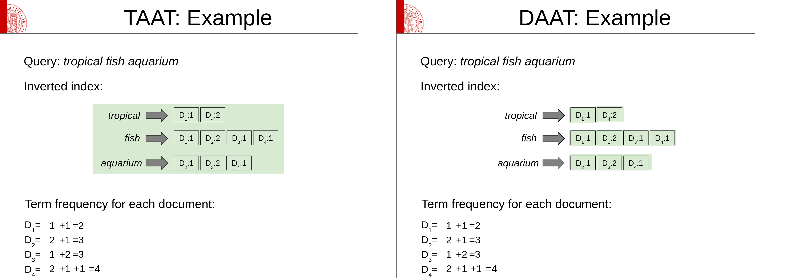

#### Safe ranking

- c'è garanzia che i $k$ documenti ritornati siano i $k$ documenti con lo score
  più elevato
- talvolta si sceglie un approccio **non-safe** per ottenere comunque un buon
  ranking, ma con costi computazionali inferiori

#### Non-safe ranking

- _**index elimination**_:
  - considerare solo termini rari (**idf alto**)
  - considerare solo **documenti che contengo almeno un certo numero di termini
    della query** $\to$ scarto di chi ne contiene meno.
- _**champion lists**_:
  - per ogni termine lo score dei documenti più rilevanti viene pre-calcolto.

## Web Information Retrieval

### Web Crawling

- processo di ottenimento delle pagine dal web
- si vuole farlo in modo **veloce**, tramite la struttura **interconnessa**
  del web. $\to$

Fasi del crawling:

1. si parte da uno o più **URL** $\to$ **seeds**
2. **fetch e parsing** $\to$ estrazione URL $\to$ inserirli in una coda
   detta **frontiera**
3. fetch URL nella frontiera e ripeti

Dark web non è indicizzabile e accessibile tramite crawler.

### Requisiti del crawler

- **robustezza** $\to$ deve evitare di incorrere in loop infiniti $\to$ **spider
  traps**
- **politeness** $\to$ deve rispettare le regole dei web server, rispettando il
  rating di visita

#### Robustezza

- va eseguito in modo **distribuito** su più nodi
- attenzione a pagine spam o spider traps
- anche le pagine buone possono dare problemi $\to$ pagine duplicate, latenza

#### Politeness

- **esplicita** $\to$ specifiche su file che comunicano al crawler come comportarsi
  $\to$ `robots.txt`
- **impliciti** $\to$ se non specificato, vanno evitate visite troppo frequenti

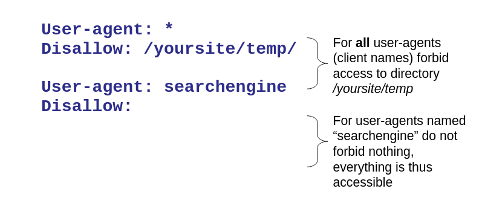

### URL frontier

2 strategia di aggiunta alla pagina:

- **DFS**
- **BFS**

### Ricerca sul web

- si costruisce l'indice sull'estrazione dati del crawler
- per garantire una ricerca corretta serve introdurre una **nozione di popolarità**
  Es. Ricerca _ebay_ $\to$ se non ho tecniche basate sulla popolarità rischio di
  non trovare la pagine giusta $\to$ ad esempio potrei avere pagine che contengono
  il termine _ebay_ più del sito stesso [Ebay](ebay.com)

### Web Information Retrieval

Il ranking non è più solo in base alla rilevanza o similarità $\to$ tengono conto
anche della probabilità.

- **content score** $\to$ grado di rilevanza $\to$ calcolato con metodi IR
- **popularity score** $\to$ quanti link in entrata ha la pagina $\to$ tramite
  operazioni di **analisi dei link**.

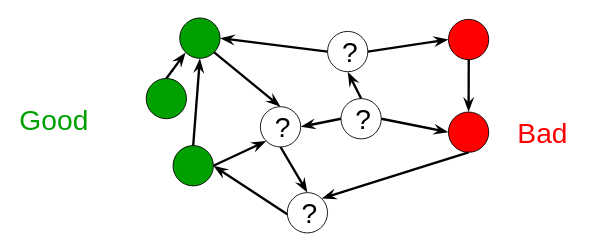

- se un nodo buono di punta sei buono
- se sei buono non punti a un nodo cattivo

#### Analisi Citazioni

- **frequenza di citazione** $\to$ stima della popolarità nella ricerca
- **frequenza a coppie** $\to$ articoli più spesso citati insieme a coppie

### PageRank

- **score numerico tra 0 e 1** a ogni node nel web
- lo score dipende dalla **struttura dei link**
- la search engine calcola un punteggio che dipende da **cosine similarity**,
  **PageRank score** e altre **centinaia** di feature.

#### Calculation

- corrisponde al calcolo della distribuzione di probabilità stazionaria di una
  _random walk_ sul web.

### Hyperlink-Induced Topic Search

- motori di ricerca che danno due insiemi di pagine:
  - _hub pages_ $\to$ link buoni per la qeury
  - _authority pages_ $\to$

### Semantic search

Evoluzione dell'information retrieval $\to$ poco successo.

## Information Retrieval Evaluation

3 elementi:

1. collezione di documenti
2. query
3. valutazione umana di rilevanza o non rilevanza per ognuna query

### Valutazione

- **user need** tradotto nella query
- la rilevanza è calcolata rispetto allo user need, non rispetto alla query
- Esempio:
  - IN: _il fondo piscina è sporco e dev'essere pulito_
  - query: _piscina più pulita_
  - si valuta quanto il documento soddisfi l'IN e non la query associata.

### Giudizi di rilevanza

- **binario**, rilevante o no. Aumentando il numero di possibilità, aumenta la precisione.
- **depth-k** polling $\to$ considera i top-**k** documenti da **n** sistemi IR differenti, un
  umano dovrà giudicare se questi **n \* K** documenti che sono molti meno dell'intera collezione.

### Collezioni TREC (Text REtrieval Conference)

La collezione più grande è TREC Gov2.
**TREC Gov2** è una **collezione standard per la ricerca dell’informazione (Information Retrieval)** usata nei benchmark del **TREC (Text REtrieval Conference)**
$\to$ **un grande dataset web governativo, con query e rilevanze, pensato per testare e confrontare sistemi di ricerca**.

### Amazon Mechanical Turk

Mechanical Turk è una piattaforma di **crowdsourcing** usata in Information Retrieval
per ottenere rapidamente giudizi umani (es. rilevanza dei documenti rispetto a una
query), utili per valutare e addestrare sistemi di ricerca, a basso costo ma con
necessità di controlli di qualità.

La qualità del risultato dipende dalla qualità dei lavoratori.

### Misure effettive

2 metriche:

- **precision** $\to$ frazione dei documenti ritornati che è rilevante all'IN
- **recall** $\to$ frazione dei documenti rilevanti è stata ritornata dal sistema

#### Precision

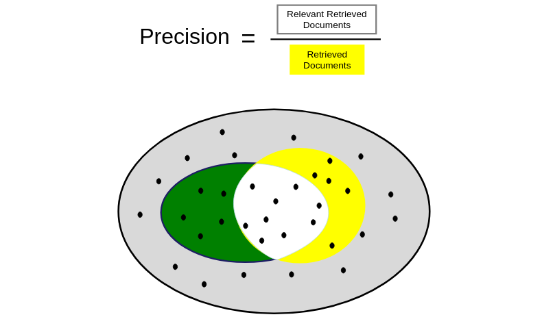

#### Recall

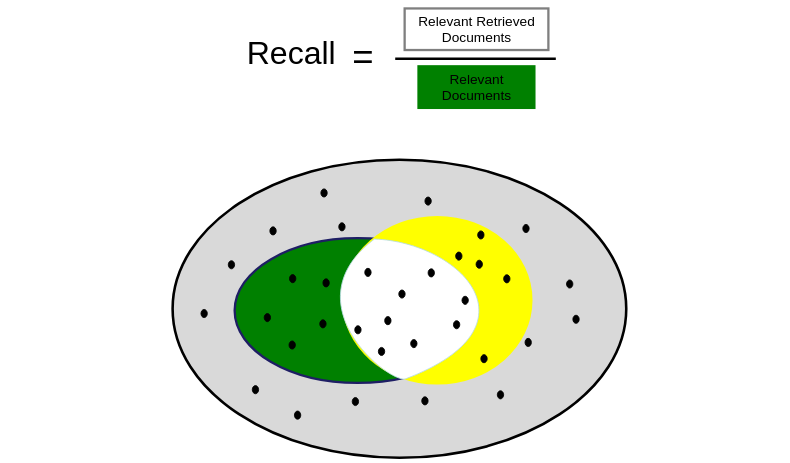

#### Precision @ K

Percentuale di documenti rilevanti tra i primi k risultati restituiti $\to$
misura quanto sono “buoni” i risultati mostrati all’utente.

#### Recall @ K

Percentuale di documenti rilevanti recuperati nei primi k risultati **rispetto a tutti i documenti rilevanti** esistenti.
$\to$ Misura quanto il sistema riesce a trovare i documenti rilevanti.

#### Average Precision

- No K arbitrario, ci si ferma quanti tutti i documenti rilevanti sono stati ottenuti
- questo valore sarebbe il valore di K per cui recall @ K = 1
- precision @ K calcolata solo per **quei K in cui sono stati ottenuti risultati rilvevanti**
- la media è l'**average precision**

#### Mean Average Precision

- calcolo AP per ogni query di test
- si calcola la media delle AP $\to$ **MAP**

#### MAP - Osservazioni

- documento non viene mai ritornato $\to$ precision corrispondente pari a 0
- ogni query ha lo stesso peso in MAP
- assume che l'utente sia interessato a ottenere più risultati rilevanti
- richiede tanti giudizi di rilevanza nella collezione testuale

### Rilevanza non binaria

- meno comuni
- Due esempi:
  - **Discounted Cumulative Gain** $\to$ i documenti nella prime posizioni
    contano di più, le metrica tiene conto della posizione nella lista
  - **Normalized Discounted Cumulative Gain** $\to$ versione normalizzata della
    soprastante

## IR Advanced Methods

### Sinonymy

Problematica legata ai sinonimi $\to$ ricerca per _airplane_ deve matchare anche
_aircraft_

### Query Expansion

- espansione query con i sinonimi
- ci sono varie tecniche automatiche o semi-automatiche (richiedono interazione
  utente per scegliere i migliori termini)
- un'alternative è data dal **suggerimento delle query**
- i termini vengono trovati da:
  - vocabolari controllati
  - collezioni di testo

- tuttavia questo metodo basata su vocabolari non è ottimale $\to$ non tiene conto
  del contesto, un'alternativa è data dalla **co-occurrence query expansion**

### Co-occurrence Query Expansion

Utilizzo di misure per valutare parole chuave collegate:

- coefficiente di Dice
- mutual information
- expected mutual information
- Pearson's Chi-squared ($\mathcal{X}^2$)

Basate su interi documento e pezzi di essi. Si assume interi documenti per
semplicità.

#### Coefficiente di Dice

$$
2n_{ab} / (n_a + n_b)
$$

- $n_a \to$ documenti che contengono la parola $a$
- $n_b \to$ documenti che contengono la parola $b$
- $n_{ab} \to$ documenti che contengono entrambe

#### Mutual Information

$$
\log \frac{P(a,b)}{P(a)P(b)}
$$

- $P(a)$ probabilità che la parola $a$ occorra in una finestra di testo
- $P(b)$ probabilità che la parola $b$ occorra in una finestra di testo
- $P(a,b)$ probabilità che le parole compaiano nella stessa finestra di testo

Il problema di questa misura è che tende a favorire i **termini con basse frequenze**.

Esempio:

- Si considerino due parole tc $n_a = n_b = 10$ e $n_{ab} = 5$, la mutua informazione è
  $5 \cdot 10^{-2}$
- Si considerino due parole tc $n_c = n_d = 1000$ e $n_{cd} = 500$, la mutua informazione è
  $5 \cdot 10^{-4}$

Nonostante entrambe le coppie co-occorrona la metà delle volte che occorrono insieme,
hanno valori di mutual information.

#### Expected Mutual Information

$$
P(a,b) \cdot \log \frac{P(a,b)}{P(a)P(b)}
$$

Vuole risolvere il problema dei termini a bassa frequenza $\to$ da un peso
al valore della mutual information tramite la probabilità $P(a, b)$
che osservando l'esempio sarà molto più alta per $c$ e $d$, andando cosi a
bilanciare i valori molto distanti delle 2 valutazioni precedenti.

#### Pearson's Chi-squared ($\mathcal{X}^2$)

$$
\frac{(n_{ab} - N \cdot \frac{n_a}{N} \cdot \frac{n_b}{N})^2}
{N \cdot \frac{n_a}{N} \cdot \frac{n_b}{N}}
$$

- paragona il numero di co-occorrenze di 2 parole con il numero di co-occorrenze
  se queste due parole fossero completamente indipendenti
- normalizza questo paragone per il numero atteso
- $N \cdot \frac{n_a}{N} \cdot \frac{n_b}{N}$ è il numero di co-occorrenze se i due
  termini fossero indipendenti

### Processo di query expansion

- query iniziale
- utilizzo di una collezione di documenti su cui applicare le 4 metriche sopra,
  sapendo che:
  - mutual information favorisce le parole rare (a volte typos)
  - anche Chi squared cattura parole rare
  - Dice e expected mutual information sono più adatte per IR

- utilizzo di un meccanismo **relevance feedback (RF)** per raffinare la query
  - Usa i documenti giudicati rilevanti dall'utente per migliorare la query
  - Estrae termini informativi dai documenti rilevanti
  - Espande o ripesa la query con questi termini
  - Migliora il matching tra query e documenti
  - Aumenta recall (e spesso precision)

- esiste anche la **pseudo RF** $\to$ RF automatica, consiste nella RF in cui si assume
  che i primi K documenti sia rilevanti, eliminando la necessità di un feedback umano

### ML and IR

- ML consente di combinare allo stesso tempo:
  - tf nel titolo
  - tf nel corpo
  - lunghezza documento
  - popolarità documento (PageRank)

- serve capire come dare il peso esatto a ciascuna caratteristica $\to$ ML
  con apprendimento da un dataset di feature e giudizi di rilevanza

- si costruisce tramite ML un classificatore che stabilisce se un documento
  è rilevante oppure no

- si tratta di un approccio recente per via della carenza di dati e per del fatto
  che sistemi di IR classici usano un set di feature ridotto

### Sistemi IR moderni

- utilizzo di un largo numero di feature, grazie alle grandi quantità di dati
  disponibili:
  - Log frequency of query word in anchor text
  - Query word color on page
  - Number of images on page
  - Number of outbound links on page
  - PageRank of page
  - URL length
  - URL contains query terms
  - Page edit recency
  - Page length

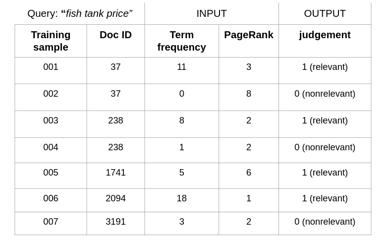

### Offline and Online learning

- i dataset di training sono ottenuti con i meccanismi di RF visti precedentemente
- **offline learning** $\to$ training prima del deployment, con un dataset fissato e
  senza aggiornamenti durante l'utilizzo dell'utente
- **online learning** $\to$ continuo aggiornamento del modello tramite **live user feedback**.

## Data Analytics

Lo scopo dell'analisi dati è quello di estrarre informazioni basiche da collezioni di
dati. $\to$ informazioni **riassuntive** (eg. media di cerit valori) o **associative**
(eg. relazione e collegamenti tra due set di valori).

Si basa sulla **statistica descrittiva**.

### DIKW Pyramid

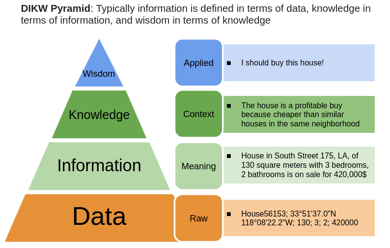

### Concepts

#### Population

Collezione di oggetti di cui siamo interessati, esempi:

- tutte le case di Los Anglese
- tutti gli studenti di un ateneo
- ...

#### Record

Tupla di valori che caratterizano **un** elemento della popolazione.

#### Variable

Nome per un valore specifico dei record, definisce un significato e un tipo
per quel dato in tutti i record.

#### Type of variable

- i tipi consentono di distinguere le variabili in base ai valori che possono assumere
- distinzione principale:
  - variabili **numeriche** o quantitative, quando si può applicare operatori aritmetici,
    a loro volta:
    - **discrete** $\to$ i valori possono essere contati
    - **continue** $\to$ sono il risultato di misure continue

  - variabili **categoriche** o qualitative, altrimenti, a loro volta:
    - **ordinal** $\to$ esiste un ordinamento possibile per i valori
    - **nominale** $\to$ altrimenti

### Statistica descrittiva

- realizzazione di indicatori sintetici per identificare con un singolo valore,
  proprietà statistiche della popolazione:
  - rispetto a una **singola variabile** $\to$ eg. media, moda, mediana
  - rispetto a **più variabili** $\to$ eg. covarianza, correlazione

#### Singola variabile

##### Media

$$
\text{mean} = \frac{\sum^n_{i=1} X_i}{n}
$$

Proprietà:

- il valore **non** proviene dalla distribuzione
- sostituzione valori nulli con la media
- questa sostituzione non altererà il valore della media

##### Mediana

Valore centrale di una popolazione di valori ordinati. Proprietà:

- indicatore robusto $\to$ valori anomali (estremamente grandi o piccoli)
- le media invece è fortemente sensibile ai valori anomali

##### Moda

Valore con la frequenza maggiore. Proprietà:

- utile e sensata anche con valori categorici
- robusta alle anomalie
- a differenza della mediana ha senso anche quanto non c'è un ordinamento dei valori
  (eg. punti nel piano)

##### Deviazione quadratica

$$
\text{dev} = \sum_{i=1}^n (x_i - \overline{x})^2
$$

Misura la differenza dei valori dalla loro media.

##### Varianza

$$
\sigma^2 = \frac{1}{n} \sum_{i = 1}^n (x_i - \overline{x})^2 = \frac{1}{n} \text{dev}
$$

Normalizza la deviazione quadratica per il numero di osservazioni.

##### Deviazione standard

$$
\sigma = \sqrt{\sigma^2}
$$

Il vantaggio rispetto alle precedenti è che viene espressa cone la stess unità di misura dei
dati.

#### Multi-variabile

Si tratta di indicatori utili per capire la relazione presenta tra 2 variabili.

##### Covarianza

$$
\text{cov}(X, Y) = \frac{\sum_{i = 1}^n (X_i - \overline{X}) \cdot (Y_i - \overline{Y})}{n}
$$

Quantifica la forza della relazione tra la variabile $X$ e $Y$. Misura quanto le due
variabili variano insieme.
Se il valore è **alto e positivo** significa che le due variabili hanno una forte relazioni
in quanto si allontanano dalle rispettive medie insieme nella **stessa direzione** $\to$
direttamente proporzionali.
Se il valore è **alto e negativo** significa che le due variabili hanno una forte relazioni
in quanto si allontanano dalle rispettive medie insieme **in direzioni opposte** $\to$
inversamente proporzionali.

Il limite della covarianza è dato dall'**unità di misura** $\to$ influenza il valore
della metrica $\to$ valori grande renderanno grande il valore della misura.

##### Correlazione

Pone una soluzione al problema della covarianza.

$$
\text{Corr}(X, Y) = \frac{\text{Cov}(X,Y)}{\sigma(X) \cdot \sigma(Y)}
$$

Il valore è compreso tra -1 e 1.
Valore vicino a 0 non sognifica che non ci siano relazioni, ma che non ci sono
**relazioni lineari**.

## Data Warehouse

Fare decision making da un DB classico è difficile:

- richiede conoscenza tecnica
- potrebbe non avere dati storici
- inadatto per reparti business
- inadatto per **data integration**

La soluzione è offerta dai **Data Warehouse**.

> Si tratta di una collezione di dati **subject-oriented**, **integrati**, **non-volatili** e **time-varying**
> destinati a supportare decisioni di management.

### Data Warehouse properties

- **subject-oriented** $\to$ interessa uno o più soggetti in base agli **analytic
  requirements** ad ogni livello del processo di decision making $\to$ si tengono
  in considerazione solo dati utili per aiutare i vari **processi di business**
- **integrated** $\to$ i dati sono il risultato di un processi di integrazione di dati
  provenienti sistemi operazioni e/o esterni.
- **nonvolatile** $\to$ accumulo dati da sistemi operazionali per un lungo periodo
  $\to$ **modifica e rimozione non** sono permessi, l'unica operazione è la rimozione
  di dati obsoleti
- **time-varying** $\to$ tiene traccia di come i dati evolgono nel tempo.

### DB design vs DW design

DB:

1. **specifica dei requisiti**
2. **design concettuale**
3. **design logico**
4. **design fisico**

Risultato finale: DB relazionale nromalizzato, in grado di garantire consistenza in
caso di update frequenti, con talvolta costi elevati per le query (tante tabella $\to$ join)

Questa modalità non va bene per le DW $\to$ servono performance elevate per
query complesse per fare analisi dati. In particolari serve:

- supporto agli **utenti finali**
- orientata all'**understandability** dei risultati, senza necessità di uno schema
  dei dati complesso
- orientata alle **performance** $\to$ la ridondanza va bene se migliora le performance,
  è richiesta meno normalizzazione

Il paradigma di progettazione usato viene chiamato **multidimensional modelling**.

### Multidimensional Modelling

Si tratta di un modello **concettuale** per le data warehouse

- dati visti come **facts** collegati a **dimensioni**
- un **fact** rappresenta il focus sull'analisi, la cosa principali a cui si è interessati
  in questi casi
- **misure** $\to$ quantificano i fatti
- **dimensioni** $\to$ servono per fornire misurazioni da prospettiva differenti:
  - **dimensione temporale** $\to$ analisi cambiamenti in un certo periodo
  - **dimensione spaziale** $\to$ analisi dati in base alla posizione dell'elemento
    d'interessa (eg. negozi di una qualche catena collocati in giro per il mondo)
- le dimensioni includono **attributi** che formano **gerarchie** che permettono
  all'utente di osservare le misure a vari livelli di dettaglio

- **aggregazione** $\to$ aggregando valori delle misure ai livelli basi della gerarchia
  si sale nella gerarchia.

### Star and Snowflake schemas

Rappresentazione del modello multidimensionale a **livello logico** attraverso
tabelle relazionali organizzati in questi due schemi. Caratteristiche:

- tabella dei fatti al centro, collegati a varie tabelle delle dimensioni
- **star schema** $\to$ una tabella per ogni dimensione, anche in caso di gerarchie
  (tabella **normalizzate** in quanto ha ridondanza)

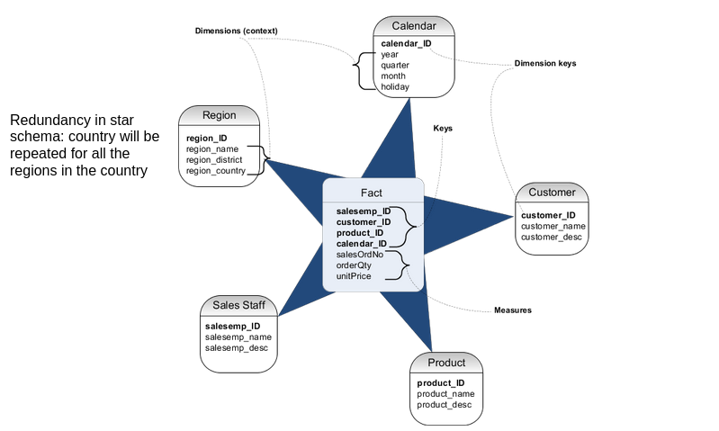

- **snowflake schema** $\to$ più tabelle **normalizzate** per ogni dimensione

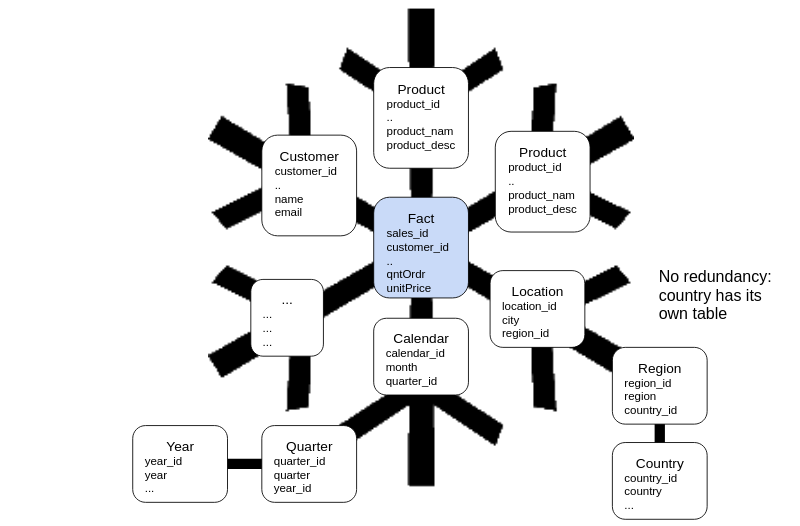

### Popolazione di una DW

- **ETF** $\to$ extraction, transformation and loading
- processo fondamentale, composta da 3 passi:
  1. **estrazione** da varie fonti
  2. **pulizia e trasformazione** per adattare i dati al modello dati della DW
  3. **caricamento** nella DW

- processo costoso, 80% circa

#### Estrazione

Estrazione dei dati rilevanti dal data source:

- **estrazione statica** $\to$ popolazione della DW per la prima volta $\to$
  si tratta di uno _snapshot_ dei dati operazionali
- **estrazione incrementale** $\to$ aggiornamento tramite log del DB e timestamps

La decisione di **cosa estrarre** è basata solo sulla qualità e la necessità dei
dati.

#### Pulizia

Obiettivi del processo di pulizia dei dati:

- Rimozione dei duplicati
- Correzione delle incoerenze
- Gestione dei valori mancanti
- Correzione di usi impropri dei campi
- Eliminazione di valori errati o impossibili
- Uniformazione dei valori per la stessa entità

#### Trasformazione

Trasformazione dai nel formato DW. L'eterogeneità delle fonti complica il processo.

- Dati testuali che conservano info importanti
- Devono subire un complesso processo di **normalizzazione $\to$ standardizzazione
  $\to$ correzione**.

### Sistemi OLTP

Online Transaction Processing $\to$ DB operazionali classici. Caratteristiche:

- dati dettagliati
- no dati storici
- normalizzazione elevata
- performance ridotte su query complesse

### Sistemi OLAP

Online Analytical Processing:

- focus su query **analitiche**
- scarsa normalizzazione
- supporto per query complesse e pesanti
- indici OLTP inadatti per OLAP $\to$ pensati per accedere a pochi dati
- query OLAP solitamente includono aggregazione

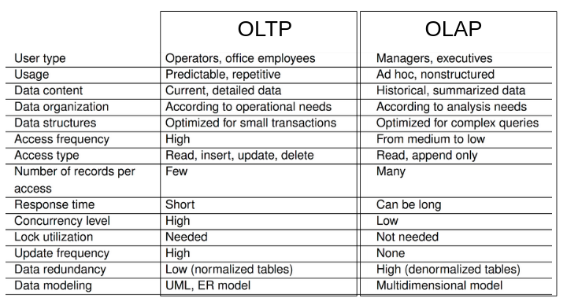

### Architettura a più livelli

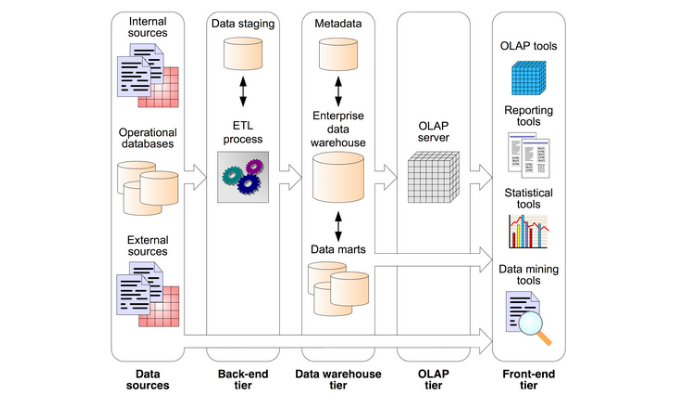

- **Data Source** $\to$ punto di partenza, non è un vero e proprio livello
- **Back-end Tier**:
  - **ETL**
  - **data stagina area** $\to$ DB intermedio dove i dati vengono processati e
    trasformati prima di essere caricati nella warehouse

- **Data Warehouse Tier**:
  - **enterprise data warehouse** e/o vari marts.
  - **metadata repository** $\to$ info su DW e/o i suoi contenuti

- **OLAP Tier** $\to$ server che fornisce una vista multidimensionale dei dati,
  **indifferentemente** dalla forma in cui sono salvati

- **Front-end tier** $\to$ data analysis, visualizzazione, contiene tool per il client:
  - OLAP tools, reporting tools, statistical tools and data-mining tools

#### Backend Tier

ETL in 3 step principali:

- **estrazione** dati da più fonti, dati eterogenei interni o esterni
- **trasformazione** $\to$ **pulizia, integrazione** da fonti diverse e **aggregazione**
- **caricamento** $\to$ aggiorna la DW con i dati trasformati, aggiornandola a
  una specifica frequenza

- **data staging area** $\to$ modifiche successive, ma prima del caricamento, detto anche \*_DB operazionale_ modifiche successive, ma prima del caricamento, detto anche
  bDB operazionale\*

#### DW Tier

- **Componenti**:
  - **enterprise data warehouse** $\to$ centralizzata, coinvolge l'intera organizzazione
  - vari **data marts** $\to$ data warehouse dipartimentale e specializzate

- **Metadati**:
  - **Business Metadata** $\to$ descrive la semantica dei dati e le regole di
    organizzazione dei datim policy e vari vincoli sui dati.
  - **Technical Metadata** $\to$ metadati tecnici che descrivono come i dati sono
    strutturati e memorizzati nel sistema e le applicazioni che li processano e
    manipolano

- **Metadata repository** $\to$ esempi di info:
  - metadati che descrivono la **struttura** della warehouse e dei marts sia a livello
    logico/concettuale (facts, dimensions, partitions, ...) e fisico (indici, partizioni)

  - info di **sicurezza** $\to$ autorizzazione e accesso dei controlli, monitoraggio
  - metadati che descrivono la pipeline di **ETL**

#### OLAP Tier

- **Componenti**:
  - **enterprise data warehouse** $\to$ centralizzata, coinvolge l'intera organizzazione
  - vari **data marts** $\to$ data warehouse dipartimentale e specializzate

- **Metadati**:
  - **Business Metadata** $\to$ descrive la semantica dei dati e le regole di
    organizzazione dei datim policy e vari vincoli sui dati.
  - **Technical Metadata** $\to$ metadati tecnici che descrivono come i dati sono
    strutturati e memorizzati nel sistema e le applicazioni che li processano e
    manipolano

#### Front-end Tier

- **OLAP tools** $\to$ esplorazione interattiva della DW, formulazione di query complesse e mirate
- **Reporting tools** $\to$ produzione, delivery e gestione di report $\to$ paper based,
  interactive o web-based $\to$ realizzati tramite query predefinite
- **Tool statistici** $\to$ uso di analisi dati con metodi statistici
- **Data mining tools** $\to$ consentono agli utenti di fare analisi per scoprire
  patter, trend, consentendo di fare **predizioni** sui dati.

### Design: Multidimensional model

- **visione n-dimensionale** dei dati (data cube)
- il cubo è formati da **dimensioni e fatti**
- **dimensioni** $\to$ prospettive usate per analizzare i dati
- Esempio: cubo 3d per dati su vendite:
  - dimensioni $\to$ prodotto, tempo, cliente
  - misura $\to$ quantità

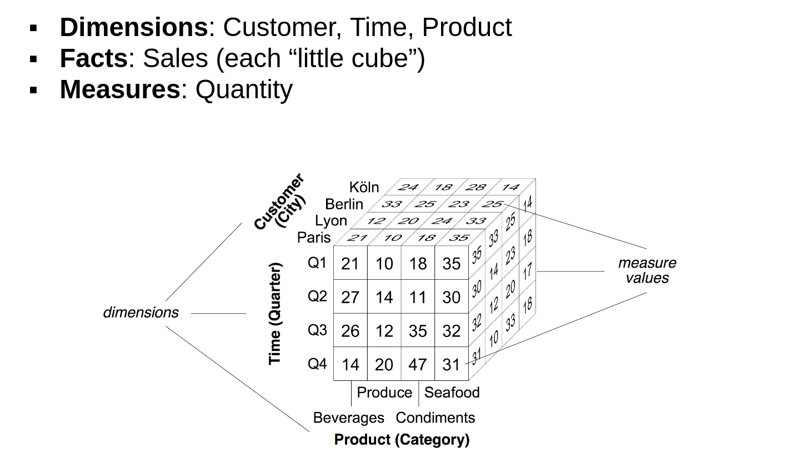

Nell'immagine ogni piccolo cubo è la quantità di unità vendute per categoria, quarter e
città del cliente.

### Data granularity

Livello di dettaglio con cui le misure sono rappresentate per ogni dimensione del cubo

- istanze di una dimensione sono dette **membri**
- i cubi potrebbero essere sparsi $\to$ potrebbere esserci combinazioni delle n dimensioni per cui
  la misura è 0

#### Gerarchie

Permettono la visione dei dati a diverse granularità:

- **lower level** è il figlio
- **istanza di dimensione** comprende tutti i membri a tutti i livelli

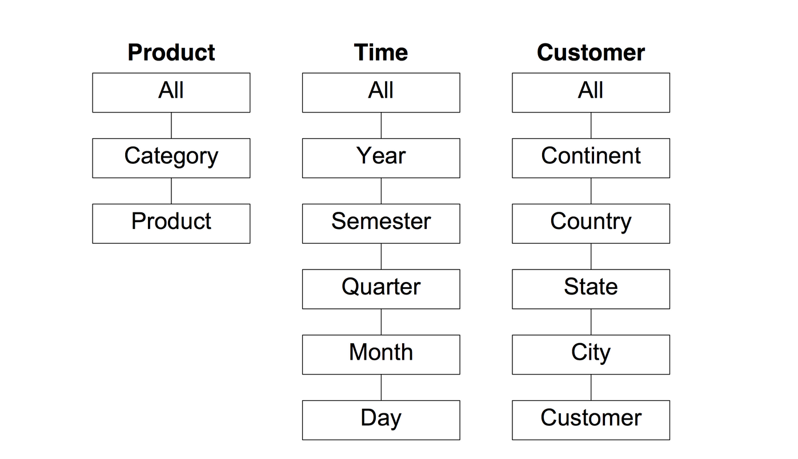

### Classificazione misure

- **additive** $\to$ possono essere riassunte sensatamente lungo tutte le dimensioni tramite addizione. Sono le più comuni.
- **semi-additive** $\to$ possono essere riassunte sensatamente lungo alcune dimensioni tramite addizione. Es: quantità
  degli inventari non sommabili sull'asse temporale (non sommi quantità di ieri e oggi per avere il totale di oggetti rimanenti).
- **non-additive** $\to$ non possono essere riassunte sensatamente lungo alcuna dimensione tramite addizione. Es: prezzo,
  costo per unità, exchange rate. Solitamente ottenibili tramite formule.

### Altre tipologie di misure

- **distributive** $\to$ definite tramite un'aggregazione calcolabile in maniera distribuita. Es: `count`, `somma`, `minimo`.
  Invece `count distrinct` non lo è.

- **algebriche** $\to$ misure definite tramite un'aggregazione esprimibile come **funzione scalare di funzioni distributive**. Es:
  media che è la divisione di 2 misure distributive.

- **olistiche** $\to$ non calcolabili da sotto aggregati. Es: `median`,`rank`.

### Query in OLAP

Operazioni:

- **roll-up**

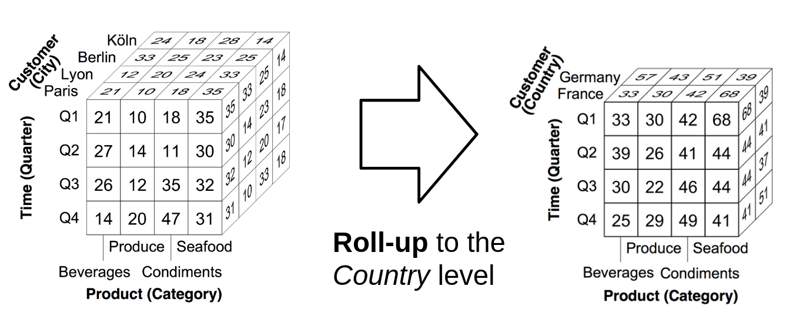

- **drill-down**

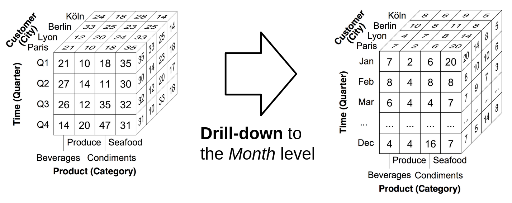

- **sort**

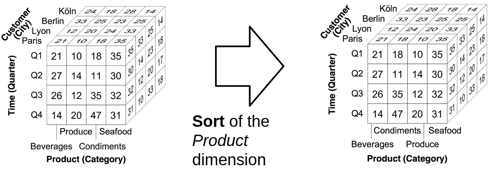

- **pivot**

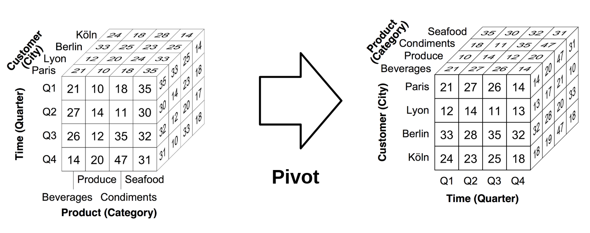

- **slice**

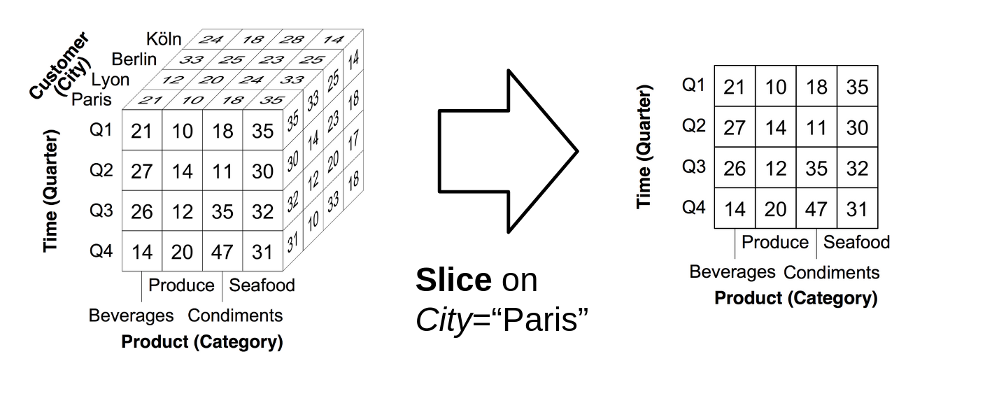

- **dice**

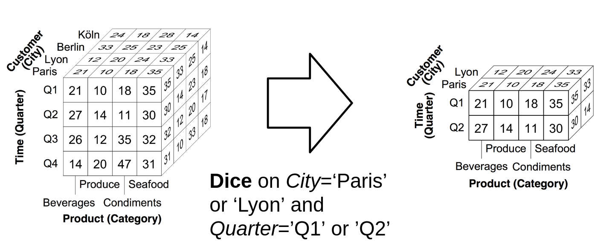

## Data Mining

Processo computazione di scoperta di pattern all'interno di grandi dataset,
usando metodi provenienti dall'intersezione fra **ML, statistica e DB**.

- dati $\to$ pattern $\to$ nuove informazioni e conoscenza

### Pattern

Sono **regolarità** nei dati che si ripetono in maniera più o meno prevedibile

### Conoscenza

Dopo aver scoperto il pattern, si cerca la **logica sottostante** per comprenderlo,
descriverlo e usarlo per fare **predizioni** di fenomeni simili.

### Grandi quantità di dati

Servono molti dati per estrarre pattern o info statisticamente significativi

### Fasi del DM

1. **definizione problema** $\to$ che conoscenza voglio ottenere
2. **identificazione dei dati che servono**
3. **preparazione e pre-processing**
4. **modellazione ipotesi** $\to$ selezione di algo di ML e tuning dei parametri
   per ottenere un buon modello predittivo
5. **training e testing**
6. **verifica e deployment** $\to$ verifica con stakeholders

### ML

- punto del DM dove sia passa dai dati ai **pattern**
- è necessario perché consente di catturare pattern non lineari, che analizzando direttamente i dati
  sarebbe pressoché impossibile
- quasi mai al 100% corretti, soprattutto per via di **rumore e casualità** nei dati
- teoria PAC $\to$ **Probably Approximately** Correct

### Nozioni su ML

- **esempio**, singola osservazione
- **variabili di input**
- **variabili di output**
- **ipotesi**
- **label**
- **prediction**

### Supervised ML

La variabile di output è parte del dataset.
2 macro-task:

- **regressione** $\to$ variabile di output è un numero
- **classificazione** $\to$ variabile di output è una classe

### Unsupervised ML

- non c'è valore per la variabile di output o non esiste proprio una variabile di output
- a volte non c'è nemmeno un obbiettivo iniziale
- task più comuni:
  - **clustering** $\to$ divisione degli esempi in vari gruppi
  - **association rules** $\to$ scoperta di relazioni interessanti tra variabili
  - **anomaly detection** $\to$ find the outliers in a set of examples
  - **generative models**
  - **feature extraction**

### Data preprocessing

Serve perché i dati reali sono **rumorosi, incompleti e inconsistenti**.
Un modello allenato su dati di scarsa qualità, sarà un modello di scarsa qualità.

#### Fasi del preprocessing

- **data cleaning** $\to$ gestione dati rumorosi, outlier, valori mancanti, inconsistenze
- **data integration** $\to$ integrazione di molteplici database, data cubes o file
- **data trasformation** $\to$ testo e categorie devono essere trasformate in un qualche spazio vettoriale
  per essere elaborati correttamente, qui diventa fondamentale la **normalizzazione**

##### Cause di dati di bassa qualità

- **valori mancanti**:
  - non applicabili al momento della raccolta
  - considerazioni diversi tra il momento della raccolta e il momento dell'analisi (???)
  - problemi umani o di sw

- **dati rumorosi**:
  - errori negli strumenti di raccolta
  - errori di inserimento
  - errori di trasmissione

- **dati inconsistenti**:
  - fonti diverse
  - violazione di dipendenze funzionali (dati legati fra loro)Anche dati duplicati vannp rimossi.

### Gestione dati mancanti

Riempimento automatico:

- costante
- media fra vari elementi
- mediana
- valore più probabile

### Gestione dati rumorosi

Valori errati in fase di inserimento o varianza elevata causa misurazione di bassa
qualità.

Tecniche:

- **binning** $\to$ valori che sono outliers aggiustati con la media di quelli più
  vicini, tramite suddivisione degli elementi in $n$ **bin** che contengono lo stesso
  numero di elementi. Per poterlo fare, i valori devono essere ordinati. Realizzano
  il **local smoothing**.
- **regression** $\to$ sistema i daati tramite funzioni di regressione.
- **clustering** $\to$ detection e rimozione outliers $\to$ elementi che non compaiono in
  alcun cluster
- **ispezione umana** combinata con metodi automatici precedenti

A differenza della DW, in DM potrebbe essere non necessario gestire il rumore dei
dati grazie alle **tecniche di regolarizzazione**.
Si consiglia quindi si costruire prima un modello senza denoising e poi iterare
osservando i risultati ottenuti.

### Gestion Data integration

Il problema principale consiste nel **entity identification problem**.

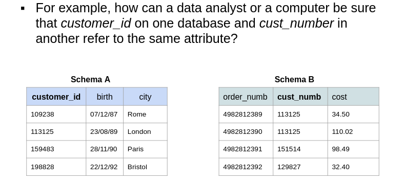

Per risolverlo si usano i **metadati**:

- **nome dell'attributo** $\to$ misure di distanza fra i due nomi per vedere
  quanto le stringhe siano simili
- **data type**
- **range di valori** $\to$ se i range sono molto diversi, è probabile che siano due
  dati differenti

Non è un processo realizzabile in modo automatizzato all 100%.

### Gestione Data transformation

- **variabili non numeriche**
- **problema dello scaling** $\to$ valori alti sono dannossi per modelli di ML

Valori normalizzati migliorando la convergenza.

#### Text encoding

Una tecnica (datata) è la **bag of words** $\to$ $x_i$ nel vettore sarà 1 se
l'**i-esima** parola del set di parole è nel testo in questione. I vettori
risultanti sono molto lunghi e con molti 0 $\to$ sparsi.

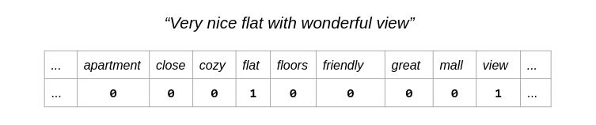

#### Encoding categorie

- Simile a bow, con la differenza che sono una classe per volta sarà 1 $\to$ **one hot encoding**
- Non richiede il preprocessing che è richiesto dal testo

#### Normalizzazione

$$
\text{scale}(v) = \frac{\text{v} - \min(\text{values})}{\max(\text{values}) - \min(\text{values})}
$$
